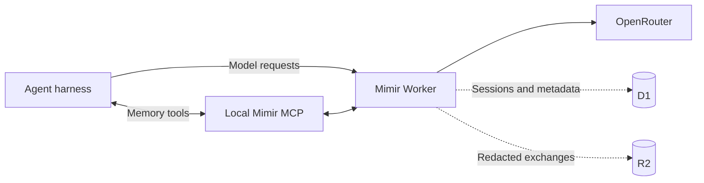

# Mimir


**Durable session memory for coding agents.**

Mimir is a private memory plane for coding agents. It captures redacted model
exchanges as searchable sessions and gives agents access to that history
through MCP. Everything runs in your Cloudflare account.

No Mimir account. No hosted backend. No shared memory service.

## Why

Agents forget previous attempts, diagnosed errors, relevant files, and fixes
that actually shipped. Mimir lets them search that work before starting over.

```text
Agent searches Mimir before changing authentication.

Mimir finds:
- a discarded attempt with the same token-validation error
- the files and exchanges involved
- the approach that failed

Agent avoids repeating it.
```

## How It Works



Two connections, two jobs:

1. **Model traffic** flows through the Worker proxy. Capture is a side effect
   of this path — the Worker redacts a copy of each exchange, writes it to R2,
   and indexes session metadata in D1 while streaming the upstream response.
   There is no save operation and no backfill: if traffic does not pass
   through the Worker, nothing is captured.
2. **Memory access** flows through the local `mimir serve` MCP process. These
   tools read and annotate what the proxy already captured — they never write
   exchanges themselves.

Saved means an exchange is durably persisted; Landed means the work produced a
kept result. Neither state implies the other.

After meaningful work, agents verify capture through `session_status`. The
harness receives one compact receipt instead of infrastructure output:

```text
Saved to Mimir · 14 exchanges in this session · View session
```

The dashboard link appears only when Cloudflare Access is configured.

`x-mimir-session` provides an exact session boundary when a harness supports
it. Otherwise, Mimir groups requests using repository, harness, and a
15-minute inactivity gap.

## Install

You need a Cloudflare account, an OpenRouter API key, Go 1.25+, Node.js 22
with npm, and Bun.

```bash
go install github.com/cloudboy-jh/mimir/cmd/mimir@latest
mimir setup
```

Setup opens Cloudflare browser authentication on first run, provisions D1 and
R2, builds and deploys the Worker, stores the OpenRouter key as a Worker
secret, registers the machine, and verifies the connection. It also prompts
for an optional Cloudflare API token that automates dashboard Access; press
Enter to skip and finish Access later with `mimir access`. Secrets are entered
through local masked prompts.

On another machine:

```bash
go install github.com/cloudboy-jh/mimir/cmd/mimir@latest
mimir login
```

`mimir login` also writes the opencode integration automatically (see below).

For agent-assisted setup:

```bash
npx skills add cloudboy-jh/mimir
```

Then ask the agent to set up Mimir for the active harness.

## Commands

```bash
mimir setup [--quick] [--json]      # provision and deploy the memory plane
mimir login [--json]                # register this machine; writes opencode integration
mimir deploy [--json]               # ship Worker and dashboard changes
mimir access [--token <api-token>]  # create or fix the dashboard Access application
mimir dashboard                     # open the dashboard
mimir list [--repo name] [--outcome <o>] [--limit 20]
mimir session status <id> [--json]  # verified capture receipt
mimir session outcome <id> <landed|discarded|abandoned|unresolved> [--reason text]
mimir reconcile                     # reconcile session state
mimir update [--check]              # update the CLI
```

Diagnostics and harness integration (`mimir help advanced`):

```bash
mimir connection                    # connection manifest for harness wiring
mimir whoami                        # deployment identity and counts
mimir session <id>                  # read a session and its exchanges
mimir search <query>                # search session memory
mimir config get | set <key> <json> # deployment configuration
mimir index [--full]                # build the local code index
mimir recall <query> [--budget 4000] [--json]
mimir mark <session> <outcome>      # deprecated; use session outcome
mimir outcome git <session>         # derive outcome from git history
mimir serve                         # run the MCP server (harness-managed)
```

`mimir deploy` materializes the packaged Worker, builds the dashboard, writes
the real D1 database ID into the materialized config, and deploys. Do not run
`wrangler deploy` from a source checkout; the checked-in `wrangler.jsonc`
keeps a placeholder database ID by design.

## Connect An Agent

### opencode

`mimir login` writes both pieces automatically:

- A plugin at `~/.config/opencode/plugins/mimir.ts` that points the
  `openrouter` provider at the Worker and attaches `x-mimir-session`,
  `x-mimir-repo`, and `x-mimir-harness` headers per request — so every
  opencode session gets an exact session boundary.
- A `mimir` entry in the MCP section of `opencode.json` for memory tools.

Restart opencode after login. Sessions are captured whenever the active model
uses the `openrouter` provider.

### Other harnesses

```bash
mimir connection
```

It returns the connection manifest: OpenAI and Anthropic base URLs, a secure
local credential source (file path or command), the absolute MCP command, and
the optional session metadata headers. Apply those values using the harness's
own provider and MCP configuration.

Provider configuration has this general shape — point the harness's
OpenAI-compatible provider at the Worker, sourced from the credential file
rather than pasted:

```json
{
  "provider": {
    "mimir": {
      "npm": "@ai-sdk/openai-compatible",
      "options": {
        "baseURL": "<openai_base_url from mimir connection>",
        "apiKey": "<value read from credential_file>",
        "headers": { "x-mimir-harness": "<harness-name>" }
      }
    }
  }
}
```

The model IDs in the provider's model list only control the harness's picker;
the Worker passes through any OpenRouter model ID.

A local MCP registration has this general shape:

```json
{
  "mimir": {
    "type": "local",
    "command": ["/absolute/path/to/mimir", "serve"],
    "enabled": true
  }
}
```

The compact MCP surface includes:

| Tool | Purpose |
| --- | --- |
| `whoami` | Verify the deployment. |
| `sessions_list` | List captured sessions. |
| `sessions_get` | Read a session and its exchanges. |
| `session_status` | Show a verified capture receipt and, when Access is configured, a dashboard link. |
| `search` | Search session memory and optional local code recall. |
| `session_set_outcome` | Record a work outcome with evidence. |
| `config_get` | Read deployment configuration. |
| `config_set` | Update deployment configuration. |

The included `mimir-use` skill teaches agents to search this memory and verify
capture automatically during normal work.

## Dashboard

```bash
mimir dashboard
```

The dashboard reads live session metadata from D1 and redacted request and
response payloads from R2. Browser routes live under `/dashboard/*`, so direct
session links refresh safely without colliding with machine APIs. Cloudflare
Access protects dashboard data and receipt links without storing machine
tokens in the browser.

The Access application must cover exactly two destinations: `/dashboard` and
`/dashboard/*` (Access paths are exact matches, so the wildcard is required
for the API routes underneath). Machine API routes stay outside Access; the
Worker authenticates them with bearer tokens. Covering the bare hostname
blocks the proxy, CLI, and MCP. `mimir access` creates or corrects the
application automatically:

```bash
mimir access
```

With a Cloudflare API token (flag, env, or masked prompt), `mimir access`
creates or fixes the application and allow policy, writes the verification
variables, and redeploys. Without a token it prints the manual checklist.

The token needs exactly two permission rows, account-scoped with no zones:
`Access: Apps and Policies → Edit` and
`Access: Organizations, Identity Providers, and Groups → Read`. Create it at
<https://dash.cloudflare.com/profile/api-tokens>.

## Documentation

- [`docs/Spec.md`](docs/Spec.md): architecture, APIs, storage, security, and current limitations
- [`docs/PRODUCT.md`](docs/PRODUCT.md): product direction
- [`docs/DESIGN.md`](docs/DESIGN.md): dashboard design system
- [`docs/next-steps.md`](docs/next-steps.md): incomplete implementation work
- [`docs/opencode-capture-setup.md`](docs/opencode-capture-setup.md): how capture works and how to wire a harness provider
- [`AGENTS.md`](AGENTS.md): repository structure and development commands
