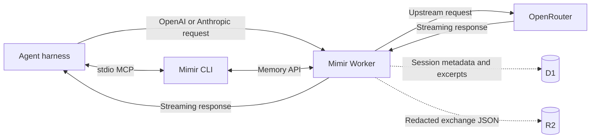

# Mimir


Mimir is a private memory plane for coding agents. It proxies model requests to
OpenRouter, captures redacted exchanges as sessions, and gives agents access to
that history through MCP. The Worker, database, archive, and credentials stay
in your Cloudflare account.

No Mimir account. No hosted Mimir backend. No shared memory service.

## What It Does

- Proxies OpenAI Chat Completions and Anthropic Messages requests to OpenRouter.
- Preserves streaming responses while saving exchanges asynchronously.
- Stores complete redacted exchanges in R2.
- Indexes sessions, excerpts, outcomes, and R2 references in D1.
- Exposes session memory through a local stdio MCP server.
- Supports exact session IDs or automatic inactivity-based grouping.
- Keeps optional repository code recall in `.mimir/index.json`.

Mimir is designed for one developer using multiple agents, repositories, and
machines against one self-hosted deployment.

## Quick Start

You need:

- A Cloudflare account
- An OpenRouter API key
- Go 1.25 or newer
- Node.js 22 with npm
- Bun

Install and deploy:

```bash
go install github.com/cloudboy-jh/mimir/cmd/mimir@latest
mimir setup
```

`mimir setup` authenticates with Cloudflare, creates or reuses D1 and R2,
applies migrations, builds the dashboard assets, registers this machine,
stores the OpenRouter key as a Worker secret, deploys the Worker, and verifies
the connection.

Secrets are entered through local masked prompts. They should never be pasted
into an agent conversation.

To reconnect another machine:

```bash
go install github.com/cloudboy-jh/mimir/cmd/mimir@latest
mimir login
```

Setup and login prepare Mimir and print a connection manifest. The active agent
harness must still be configured with the returned model base URL, credential,
and MCP command.

### Agent-Assisted Setup

Install the repository's setup and usage skills:

```bash
npx skills add cloudboy-jh/mimir
```

Then ask the agent to set up Mimir for the active harness. The setup skill uses
the same CLI flow and connection manifest; it is not a separate hosted service.

## Connect Your Agent

Mimir has two independent connections:

1. **Model traffic** goes through the deployed Worker so exchanges can be
   captured.
2. **Memory tools** use the local `mimir serve` MCP server to query captured
   sessions.

For the complete machine-readable configuration, run:

```bash
mimir connection
```

It returns:

```json
{
  "openai_base_url": "https://<worker>.workers.dev/v1",
  "anthropic_base_url": "https://<worker>.workers.dev",
  "credential_file": "/absolute/path/to/.mimir/token",
  "credential_command": ["cat", "/absolute/path/to/.mimir/token"],
  "mcp_command": ["/absolute/path/to/mimir", "serve"],
  "optional_headers": [
    "x-mimir-session",
    "x-mimir-repo",
    "x-mimir-harness"
  ]
}
```

Use the OpenAI base URL for OpenAI-compatible Chat Completions clients. Use the
Anthropic base URL for Anthropic Messages clients. Authenticate with the local
machine token using the secure credential mechanism supported by the harness.

### MCP

Mimir's MCP server is a local stdio process:

```bash
mimir serve
```

Register the exact `mcp_command` returned by `mimir connection`. It uses an
absolute executable path so desktop applications do not depend on your shell's
`PATH`.

OpenCode example:

```json
{
  "mcp": {
    "mimir": {
      "type": "local",
      "command": ["/absolute/path/to/mimir", "serve"],
      "enabled": true
    }
  }
}
```

Hermes example:

```yaml
mcp_servers:
  mimir:
    command: /absolute/path/to/mimir
    args: ["serve"]
```

The MCP server exposes seven tools:

| Tool | Purpose |
| --- | --- |
| `whoami` | Verify the deployment and return session/log counts. |
| `sessions_list` | List remembered sessions. |
| `sessions_get` | Read one session and its captured exchanges. |
| `search` | Search remote session memory and optional local code recall. |
| `mark` | Set a session outcome to `promoted`, `discarded`, `abandoned`, or `unknown`. |
| `config_get` | Read deployment configuration. |
| `config_set` | Update deployment configuration. |

The included `mimir-use` skill teaches agents to search this memory before
substantial work and inspect relevant sessions instead of asking the user to
operate Mimir manually.

### Session Metadata

Harnesses can attach these headers to model requests:

| Header | Value |
| --- | --- |
| `x-mimir-session` | Stable session ID. This is the authoritative session boundary. |
| `x-mimir-repo` | Repository name or URL. |
| `x-mimir-harness` | Harness name, such as `opencode` or `hermes`. |
| `x-mimir-git-ref` | Branch or source ref at session start. |

Headers are optional. Without an exact session ID, Mimir groups requests by
repository, harness, and an inactivity window.

## How It Works



The Worker validates the machine credential, removes Mimir metadata before
forwarding, and sends the request to OpenRouter. After a response is available,
capture continues through `waitUntil` so persistence does not block delivery of
the upstream response.

R2 receives one redacted JSON object per saved exchange. D1 receives searchable
metadata, excerpts, usage, outcomes, facets, and the corresponding R2 key.

## Storage And Security

- The OpenRouter API key is stored as an encrypted Cloudflare Worker secret.
- Every machine receives an independent random bearer token.
- Only SHA-256 hashes of machine tokens are stored in D1.
- The local token is stored under `~/.mimir/token` with restricted permissions.
- Machine proxy, CLI, and MCP requests use bearer-token authentication.
- Dashboard API and dashboard log-object routes use Cloudflare Access JWTs.
- Redaction runs before an exchange is written to R2.
- Wrangler observability remains inside your Cloudflare account.

Mimir currently accepts requests up to 10 MiB and captures responses up to
20 MiB. Redaction reduces accidental secret retention; it is not a substitute
for avoiding unnecessary secrets in model prompts.

## Dashboard

Open the deployed dashboard with:

```bash
mimir dashboard
```

Current status: the Vue dashboard is a design preview backed by mock data. It
is built and deployed with the Worker, but it is intentionally not connected to
captured sessions yet. Worker dashboard APIs and Cloudflare Access verification
exist, but dashboard integration remains incomplete.

The CLI and MCP session APIs are the working interfaces for captured memory.

## CLI

Primary commands:

```text
mimir setup [--quick] [--json]
mimir login [--json]
mimir dashboard
```

Integration and diagnostic commands:

```text
mimir connection
mimir whoami
mimir sessions
mimir session <id>
mimir search <query>
mimir mark <session> <outcome>
mimir config get
mimir config set <key> <json-value>
mimir serve
```

Local repository recall and Git outcome helpers:

```text
mimir index [--full]
mimir recall <query> [--budget 4000] [--json]
mimir outcome git <session>
```

Run `mimir help advanced` for the complete advanced command list.

## Development

Dashboard:

```bash
bun run dev
bun run typecheck
bun run build
```

Worker:

```bash
npm --prefix worker ci
bun --cwd=worker/web install --frozen-lockfile
npm --prefix worker test
npm --prefix worker run typecheck
cd worker && npx wrangler deploy --dry-run
```

CLI and MCP:

```bash
go test ./...
go build -o /tmp/mimir ./cmd/mimir
```

## Current Limitations

- OpenRouter is the only upstream provider.
- The proxy implements OpenAI Chat Completions and Anthropic Messages, not each
  provider's complete API surface.
- The dashboard still uses mock data.
- Local code indexing must be run explicitly with `mimir index`.
- There is no multi-user tenancy, team management, or SaaS control plane.
- There is no automated retention or deletion workflow.

## Documentation

- [`docs/PRODUCT.md`](docs/PRODUCT.md): product direction
- [`docs/DESIGN.md`](docs/DESIGN.md): dashboard visual direction
- [`docs/Spec.md`](docs/Spec.md): implementation and architecture background
- [`AGENTS.md`](AGENTS.md): repository structure and contributor commands
