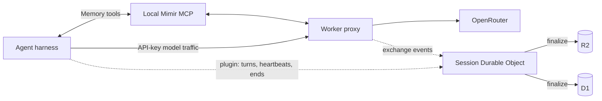

# Mimir


**Durable session memory for coding agents.**

Mimir is a private memory plane. It captures what your agents did — every
provider, every auth mode — as searchable sessions, and gives agents access
to that history through MCP. Everything runs in your Cloudflare account.

No Mimir account. No hosted backend. No shared memory service.

## Why

Agents forget previous attempts, diagnosed errors, relevant files, and fixes
that actually shipped. Mimir lets them search that work before starting over.

```text
Agent searches Mimir before changing authentication.

Mimir finds:
- a discarded attempt with the same token-validation error
- the files and exchanges involved
- the approach that failed

Agent avoids repeating it.
```

## How It Works



Two reporters, one owner, one filing cabinet:

1. **The Worker proxy** captures API-key providers as a side effect of model
   traffic — redacted exchanges to R2, metadata to D1, streamed upstream.
2. **Harness plugins** (OpenCode, Hermes) observe completed turns inside the
   agent, covering OAuth and subscription providers the proxy can't touch.
3. **A Session Durable Object per session** owns the lifecycle: liveness, the
   live feed, and the final write. Sessions end three ways — harness end
   event, ~10-minute silence timer (covers killed terminals and crashes), or
   explicit end via MCP or CLI. Closing a terminal always writes the session.

Memory access flows through the local `mimir serve` MCP process. Agents
verify capture with `session_status` and get one compact receipt:

```text
Saved to Mimir · 14 exchanges in this session · View session
```

## Install

You need a Cloudflare account, an OpenRouter API key, Go 1.25+, Node.js 22
with npm, and Bun.

```bash
go run github.com/cloudboy-jh/mimir/cmd/mimir@latest install
mimir setup        # first machine: provision and deploy
# On another machine with an existing deployment:
mimir login
```

Setup provisions D1 and R2, deploys the Worker, stores the OpenRouter key as
a Worker secret, and registers the machine. Secrets are entered through local
masked prompts. The installed binary embeds the Worker, dashboard sources,
OpenCode and Hermes plugins, and Mimir skills, so setup and deploy do not select
another version from the Go module cache or require a source checkout. Node.js,
npm, and Bun are still used locally to build the embedded Worker package.

Mimir records the exact harness files it owns in
`~/.mimir/install-receipt.json` and appends operations to
`~/.mimir/install-log.jsonl` (under `$MIMIR_HOME` when set). It creates absent
opted-in files, adopts byte-identical files, updates only receipt-owned and
unmodified files, preserves modified or conflicting files, and rejects
symlinked targets. It never manages general OpenCode configuration.

`mimir update --check` checks release status. Explicit `mimir install` and
`mimir update` enroll safe absent or byte-identical global harness files and
refresh unchanged receipt-owned files. They also remove retired bundle files
only when the receipt still owns their exact bytes; changed, missing, or unsafe
retired paths remain recorded and preserved. Setup and login only refresh an
existing managed installation. `mimir doctor` reports connection and integration
problems. `mimir uninstall` removes only
unchanged receipt-owned plugin and skill files and the verified installer-owned
binary. Modified, missing, unowned, non-regular, and symlinked paths are
preserved and reported. The exact Mimir-managed Hermes `.env` route block is
removed without touching `OPENROUTER_API_KEY`; malformed or modified blocks are
preserved. On Windows, a running verified binary is renamed and a detached
standard-user cleanup process deletes it after the uninstall process exits;
the uninstall report marks that removal as deferred. Use `--keep-binary` to
retain the CLI.

## Connect An Agent

### opencode

The installer enrolls the bundled plugin as the exact global file
`~/.config/opencode/plugins/mimir.ts`; lifecycle updates may refresh that
receipt-owned file but never rewrite OpenCode JSON/JSONC, providers,
credentials, commands, or MCP settings. It covers every OpenCode provider:
OpenRouter, Zen subscription, Claude key, and Codex/ChatGPT OAuth. Manual copy
is a recovery path only.
[Details](docs/opencode-capture-setup.md).

### Hermes desktop and TUI

Two cooperating paths are installed from the embedded bundle when Hermes is
detected:

- `mimir setup`/`login`/`update` redirect Hermes' built-in OpenRouter
  provider through the Worker using a bounded managed `.env` block while
  preserving existing assignments.
- The Hermes plugin captures Nous portal and direct providers from inside the
  harness. Manual copying is a recovery path only.

[Details](docs/hermes-capture-setup.md).

### Other harnesses

```bash
mimir connection
```

Prints the connection manifest: base URLs, local credential source, MCP
command, and optional session metadata headers. Apply them through the
harness's own provider and MCP configuration.

## Commands

```bash
mimir setup [--quick]               # provision and deploy the memory plane
mimir login                         # register this machine
mimir deploy                        # ship Worker and dashboard changes
mimir access                        # create or fix dashboard Access
mimir dashboard                     # open the dashboard
mimir list [--repo name]            # recent sessions
mimir session status <id>           # verified capture receipt
mimir session end <id>              # end a session, optionally with outcome
mimir search <query>                # search session memory
mimir doctor                        # validate connection and harness wiring
mimir update [--check]              # update the CLI
mimir uninstall [--keep-binary]     # remove verified managed files
mimir --version                     # binary build only; reads no install state
mimir version [--json]              # build and managed-install summary
```

Installation itself is
`go run github.com/cloudboy-jh/mimir/cmd/mimir@latest install`. Uninstall keeps
`~/.mimir/config`, the machine token, materialized Worker files,
`install-log.jsonl`, and the Cloudflare deployment. It does not disconnect or
delete the remote memory plane.

More (`mimir help advanced`): `connection`, `whoami`, `session <id>`,
`session outcome`, `reconcile`, `config`, `index`, `recall`, `serve` (MCP).

Deploys go through `mimir deploy` only — the checked-in `wrangler.jsonc`
keeps a placeholder database ID by design; never `wrangler deploy` from a
source checkout.

## Dashboard

```bash
mimir dashboard
```

Reads session metadata from D1 and redacted payloads from R2. Cloudflare
Access protects browser data without storing machine tokens in the browser;
`mimir access` automates the application (it must cover exactly `/dashboard`
and `/dashboard/*`). Machine API routes stay outside Access on bearer tokens.

## Documentation

- [`docs/Spec.md`](docs/Spec.md): architecture, APIs, storage, security
- [`docs/session-lifecycle.md`](docs/session-lifecycle.md): session objects, reporters, end-of-session guarantees
- [`docs/opencode-capture-setup.md`](docs/opencode-capture-setup.md) / [`docs/hermes-capture-setup.md`](docs/hermes-capture-setup.md): harness capture
- [`docs/PRODUCT.md`](docs/PRODUCT.md): product direction
- [`docs/DESIGN.md`](docs/DESIGN.md): dashboard design system
- [`docs/next-steps.md`](docs/next-steps.md): incomplete implementation work
- [`AGENTS.md`](AGENTS.md): repository structure and development commands
