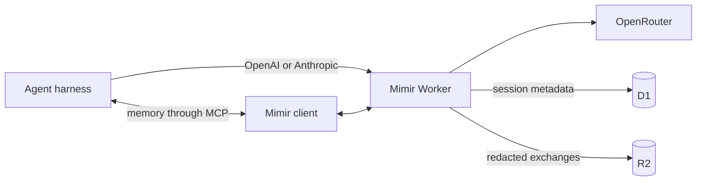

# Mimir


## Your agents forget. Mimir doesn't.

Coding agents lose the useful parts of yesterday's work: approaches that
failed, errors already diagnosed, files that mattered, and fixes that actually
shipped.

Mimir gives them memory.

It captures redacted model exchanges through an OpenRouter-compatible proxy,
organizes them into searchable sessions, and exposes that memory back to agents
through MCP. Everything runs in your Cloudflare account.

No Mimir account. No hosted backend. No shared telemetry.

## Stop repeating failed work

Without Mimir:

```text
User: Fix the authentication regression.
Agent: I'll replace the token validation path.
```

The agent repeats an approach that already failed in another session.

With Mimir:

```text
Agent searches memory before changing authentication.

Mimir finds:
- a discarded attempt touching src/auth.ts
- the same token-validation error
- the files and model exchanges from that attempt

Agent avoids the failed approach and continues from what was learned.
```

Memory access happens inside the agent workflow. The user does not search a
database, manage transcripts, or operate Mimir between sessions.

## Quick start

Install the setup skill:

```bash
npx skills add cloudboy-jh/mimir
```

Then tell your agent:

```text
Set up Mimir for this harness.
```

The skill installs the CLI, provisions Mimir in your Cloudflare account, and
connects the active harness using a standard OpenAI or Anthropic configuration.
Secrets are entered locally and are never requested through chat.

You need a Cloudflare account, an OpenRouter API key, Go, and Node.js with npm.

To set it up directly instead:

```bash
go install github.com/cloudboy-jh/mimir/cmd/mimir@latest
mimir setup
```

On another machine, run `mimir login`. That is the complete human CLI workflow.

## How it works



For every completed model request, Mimir:

1. preserves the upstream response stream;
2. reconstructs and redacts a copy asynchronously;
3. stores the full exchange in R2;
4. stores searchable session metadata and the R2 reference in D1.

Harnesses may provide an exact session ID, repository, and harness name. When
they do not, Mimir derives sessions from the telemetry stream using a short
inactivity gap. Either way, capture works without a bespoke backend adapter.

The connection contract is intentionally small: OpenAI and Anthropic base URLs,
a local credential source, an MCP command, and optional telemetry headers. Any
compatible harness can use it.

## Your memory, in your account

Full redacted exchanges live in your R2 bucket. Searchable metadata lives in
your D1 database. The OpenRouter key is an encrypted Worker secret. Each machine
gets an independent credential, and only its SHA-256 hash is stored remotely.

Mimir is built for personal scale: one developer, one Cloudflare deployment,
direct writes, and permanent memory. There is no tenancy layer, dashboard,
retention service, queue, or SaaS control plane.

Read the full architecture in [`spec.md`](spec.md). Deferred work is tracked in
[`next-steps.md`](next-steps.md).
