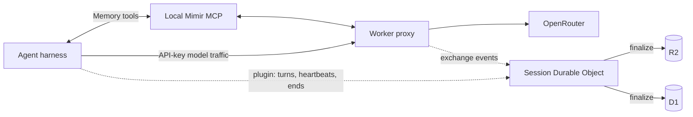

# Mimir


**Durable session memory for coding agents.**

Mimir is a private memory plane. It captures what your agents did — every
provider, every auth mode — as searchable sessions, and gives agents access
to that history through MCP. Everything runs in your Cloudflare account.

No Mimir account. No hosted backend. No shared memory service.

## Why

Agents forget previous attempts, diagnosed errors, relevant files, and fixes
that actually shipped. Mimir lets them search that work before starting over.

```text
Agent searches Mimir before changing authentication.

Mimir finds:
- a discarded attempt with the same token-validation error
- the files and exchanges involved
- the approach that failed

Agent avoids repeating it.
```

## How It Works



Two reporters, one owner, one filing cabinet:

1. **The Worker proxy** captures API-key providers as a side effect of model
   traffic — redacted exchanges to R2, metadata to D1, streamed upstream.
2. **Harness plugins** (OpenCode, Hermes) observe completed turns inside the
   agent, covering OAuth and subscription providers the proxy can't touch.
3. **A Session Durable Object per session** owns the lifecycle: liveness, the
   live feed, and the final write. Sessions end three ways — harness end
   event, ~10-minute silence timer (covers killed terminals and crashes), or
   explicit end via MCP or CLI. Closing a terminal always writes the session.

Memory access flows through the local `mimir serve` MCP process. Agents
verify capture with `session_status` and get one compact receipt:

```text
Saved to Mimir · 14 exchanges in this session · View session
```

## Install

You need a Cloudflare account, an OpenRouter API key, Go 1.25+, Node.js 22
with npm, and Bun.

```bash
go install github.com/cloudboy-jh/mimir/cmd/mimir@latest
mimir setup        # first machine: provision and deploy
mimir login        # any other machine: register and connect
```

Setup provisions D1 and R2, deploys the Worker, stores the OpenRouter key as
a Worker secret, and registers the machine. Secrets are entered through local
masked prompts. For agent-assisted setup: `npx skills add cloudboy-jh/mimir`.

## Connect An Agent

### opencode

Copy [`plugins/opencode/mimir.ts`](plugins/opencode/mimir.ts) into
`~/.config/opencode/plugins/` (global) or `.opencode/plugins/` (project).
Covers every OpenCode provider — OpenRouter, Zen subscription, Claude key,
Codex/ChatGPT OAuth. Uninstall is deleting the file.
[Details](docs/opencode-capture-setup.md).

### Hermes desktop and TUI

Two cooperating paths, both installed automatically or by file copy:

- `mimir setup`/`login`/`update` redirect Hermes' built-in OpenRouter
  provider through the Worker — richest capture, no config changes of yours.
- Copy [`plugins/hermes/`](plugins/hermes/) into the plugins directory under
  your Hermes home to capture Nous portal and direct providers from inside
  the harness.

[Details](docs/hermes-capture-setup.md).

### Other harnesses

```bash
mimir connection
```

Prints the connection manifest: base URLs, local credential source, MCP
command, and optional session metadata headers. Apply them through the
harness's own provider and MCP configuration.

## Commands

```bash
mimir setup [--quick]               # provision and deploy the memory plane
mimir login                         # register this machine
mimir deploy                        # ship Worker and dashboard changes
mimir access                        # create or fix dashboard Access
mimir dashboard                     # open the dashboard
mimir list [--repo name]            # recent sessions
mimir session status <id>           # verified capture receipt
mimir session end <id>              # end a session, optionally with outcome
mimir search <query>                # search session memory
mimir doctor                        # validate connection and harness wiring
mimir update [--check]              # update the CLI
```

More (`mimir help advanced`): `connection`, `whoami`, `session <id>`,
`session outcome`, `reconcile`, `config`, `index`, `recall`, `serve` (MCP).

Deploys go through `mimir deploy` only — the checked-in `wrangler.jsonc`
keeps a placeholder database ID by design; never `wrangler deploy` from a
source checkout.

## Dashboard

```bash
mimir dashboard
```

Reads session metadata from D1 and redacted payloads from R2. Cloudflare
Access protects browser data without storing machine tokens in the browser;
`mimir access` automates the application (it must cover exactly `/dashboard`
and `/dashboard/*`). Machine API routes stay outside Access on bearer tokens.

## Documentation

- [`docs/Spec.md`](docs/Spec.md): architecture, APIs, storage, security
- [`docs/session-lifecycle.md`](docs/session-lifecycle.md): session objects, reporters, end-of-session guarantees
- [`docs/opencode-capture-setup.md`](docs/opencode-capture-setup.md) / [`docs/hermes-capture-setup.md`](docs/hermes-capture-setup.md): harness capture
- [`docs/PRODUCT.md`](docs/PRODUCT.md): product direction
- [`docs/DESIGN.md`](docs/DESIGN.md): dashboard design system
- [`docs/next-steps.md`](docs/next-steps.md): incomplete implementation work
- [`AGENTS.md`](AGENTS.md): repository structure and development commands
