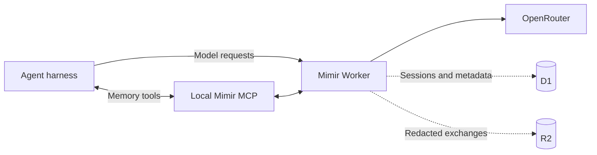

# Mimir


**Durable session memory for coding agents.**

Mimir is a private memory plane for coding agents. It captures redacted model
exchanges as searchable sessions and gives agents access to that history
through MCP. Everything runs in your Cloudflare account.

No Mimir account. No hosted backend. No shared memory service.

## Why

Agents forget previous attempts, diagnosed errors, relevant files, and fixes
that actually shipped. Mimir lets them search that work before starting over.

```text
Agent searches Mimir before changing authentication.

Mimir finds:
- a discarded attempt with the same token-validation error
- the files and exchanges involved
- the approach that failed

Agent avoids repeating it.
```

## How It Works



The Worker proxies OpenAI Chat Completions and Anthropic Messages requests to
OpenRouter. It preserves streaming responses, redacts a captured copy, stores
complete exchanges in R2, and indexes searchable session metadata in D1.

Saved means an exchange is durably persisted; Landed means the work produced a
kept result. Neither state implies the other.

After meaningful work, agents can verify capture through `session_status`. The
harness receives one compact receipt instead of infrastructure output:

```text
Saved to Mimir · 14 exchanges in this session · View session
```

The dashboard action appears only when Cloudflare Access is configured.

`x-mimir-session` provides an exact session boundary when a harness supports
it. Otherwise, Mimir groups requests using repository, harness, and inactivity.

## Install

You need a Cloudflare account, an OpenRouter API key, Go 1.25+, Node.js 22 with
npm, and Bun.

```bash
go install github.com/cloudboy-jh/mimir/cmd/mimir@latest
mimir setup
```

Setup opens Cloudflare browser authentication on first run, provisions D1 and
R2, builds and deploys the Worker, stores the OpenRouter key as a Worker
secret, registers the machine, and verifies the connection. It also prompts
for an optional Cloudflare API token that automates dashboard Access; press
Enter to skip and finish Access later with one command. Secrets are entered
through local masked prompts.

Ship Worker or dashboard changes with the same path every time:

```bash
mimir deploy
```

`mimir deploy` materializes the packaged Worker, builds the dashboard, writes
the real D1 database ID into the materialized config, and deploys. Do not run
`wrangler deploy` from a source checkout; the checked-in `wrangler.jsonc` keeps
a placeholder database ID by design.

On another machine:

```bash
go install github.com/cloudboy-jh/mimir/cmd/mimir@latest
mimir login
```

`mimir login` also writes the opencode integration automatically: a plugin at
`~/.config/opencode/plugins/mimir.ts` that routes OpenRouter traffic through
the Worker with session metadata headers, and a `mimir` entry in the MCP
section of `opencode.json`. Restart opencode after login.

For agent-assisted setup:

```bash
npx skills add cloudboy-jh/mimir
```

Then ask the agent to set up Mimir for the active harness.

## Connect An Agent

Mimir uses two connections:

1. Model traffic goes through the deployed Worker so it can be captured.
2. Memory access goes through the local `mimir serve` MCP process.

opencode is wired automatically by `mimir login`. For any other harness, run:

```bash
mimir connection
```

It returns the OpenAI and Anthropic base URLs, a secure local credential source,
the absolute MCP command, and optional session metadata headers. Apply those
values using the harness's own provider and MCP configuration.

A local MCP registration has this general shape:

```json
{
  "mimir": {
    "type": "local",
    "command": ["/absolute/path/to/mimir", "serve"],
    "enabled": true
  }
}
```

The compact MCP surface includes:

| Tool | Purpose |
| --- | --- |
| `whoami` | Verify the deployment. |
| `sessions_list` | List captured sessions. |
| `sessions_get` | Read a session and its exchanges. |
| `session_status` | Show a verified capture receipt and, when Access is configured, a dashboard link. |
| `search` | Search session memory and optional local code recall. |
| `session_set_outcome` | Record a work outcome with evidence. |
| `config_get` | Read deployment configuration. |
| `config_set` | Update deployment configuration. |

The included `mimir-use` skill teaches agents to search this memory
automatically during normal work.

## Dashboard

```bash
mimir dashboard
```

The dashboard reads live session metadata from D1 and redacted request and
response payloads from R2. Browser routes live under `/dashboard/*`, so direct
session links refresh safely without colliding with machine APIs. Cloudflare
Access protects dashboard data and receipt links without storing machine tokens
in the browser.

The Access application must cover the whole Worker hostname with no path
restriction, paired with a second application that lets machine traffic
bypass the login flow (the Worker enforces bearer tokens on those routes
itself). Scoping a single app to `/dashboard` breaks the page's API fetches;
covering the bare hostname without the bypass app blocks the proxy, CLI, and
MCP. `mimir access` creates both applications correctly:

```bash
mimir access
```

With a Cloudflare API token (flag, env, or masked prompt), `mimir access`
creates the dashboard application and allow policy, the machine bypass
application, writes the verification variables, and redeploys. Without a
token it prints the manual two-application checklist.

The token needs exactly two permission rows, account-scoped with no zones:
`Access: Apps and Policies → Edit` and
`Access: Organizations, Identity Providers, and Groups → Read`. Create it at
<https://dash.cloudflare.com/profile/api-tokens>.

## Documentation

- [`docs/Spec.md`](docs/Spec.md): architecture, APIs, storage, security, and current limitations
- [`docs/PRODUCT.md`](docs/PRODUCT.md): product direction
- [`docs/DESIGN.md`](docs/DESIGN.md): dashboard design system
- [`docs/next-steps.md`](docs/next-steps.md): incomplete implementation work
- [`AGENTS.md`](AGENTS.md): repository structure and development commands
