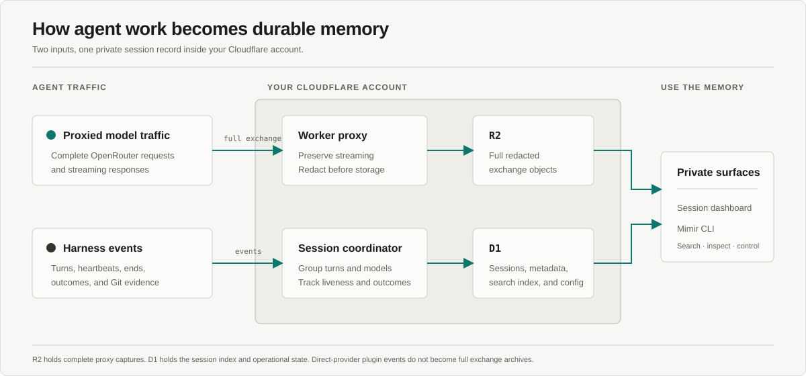

<p align="center">
  
</p>

# Private memory for coding agents

Mimir records what your agents tried, what failed, and what actually shipped.
It runs entirely inside your Cloudflare account.

```bash
go run github.com/cloudboy-jh/mimir/cmd/mimir@latest install
mimir setup
```

Setup builds and deploys the Worker and dashboard, provisions D1 and R2, stores
your OpenRouter key through a masked prompt, and connects the current machine.

Requirements: a Cloudflare account, an OpenRouter API key, Go 1.25+, Node.js 22
with npm, and Bun. To connect another machine to the same deployment, install
the CLI there and run `mimir login`.

## Stop Repeating Failed Work

Coding agents lose the context that matters between sessions: the approach that
failed, the error that explained it, the files involved, and whether the final
change survived.

```text
Before changing authentication, an agent searches Mimir.

It finds a previous session with:
  token-validation error
  auth.ts · proxy.ts · two captured exchanges
  outcome: discarded

The agent reads the evidence and avoids the same dead end.
```

Mimir keeps two facts separate:

- **Capture state** says whether durable memory was saved: Empty, Pending,
  Saved, Failed, or Partial.
- **Work outcome** says what happened to the work: Landed, Discarded,
  Abandoned, or Unresolved.

## How Mimir Works



Mimir combines two capture paths around one session boundary:

- **Worker proxy:** redirected OpenRouter traffic is streamed upstream, redacted,
  and persisted as complete request and response objects in R2. Searchable
  metadata and R2 references go to D1.
- **Harness plugins:** OpenCode and Hermes report heartbeats, completed-turn
  summaries, and supported lifecycle events for provider traffic the harness
  can observe. These summaries support live session state; they are not complete
  transport archives or searchable proxy exchanges.

When supplied, `x-mimir-session` is the authoritative session boundary. Proxied
traffic without an exact session ID falls back to bounded inactivity-based
grouping.

| Traffic path | Complete redacted exchange | Session reporting | Durable search metadata |
| --- | --- | --- | --- |
| Redirected OpenRouter | Yes, after persistence succeeds | Saved-exchange event; lifecycle when a plugin reports it | Yes |
| OpenCode OAuth, subscription, or direct provider | No | Plugin summaries and lifecycle | No full-exchange index |
| Hermes Nous portal, OAuth, or direct provider | No | Plugin summaries and lifecycle | No full-exchange index |
| Other harness using Mimir proxy URLs | Yes, after persistence succeeds | Saved-exchange event; other lifecycle only if implemented | Yes |

Hermes' managed OpenRouter route uses the proxy and suppresses duplicate plugin
turns for known proxied requests. A scheduled capture response is not proof of
persistence; `mimir session status` is the authority.

## Use The Memory

Search before starting the next attempt:

```bash
mimir search "token validation" --json
```

Inspect the full session record:

```bash
mimir session get <id> --json
```

Verify that capture reached durable storage:

```bash
mimir session status <id> --json
```

Record an evidenced result:

```bash
mimir session outcome <id> landed --reason "merged in PR 42"
```

The CLI is the primary agent surface. `mimir serve` exposes the same memory
operations through optional stdio MCP.

## Connect An Agent

### OpenCode

The installer manages the Mimir plugin and skills without rewriting general
OpenCode JSON or JSONC. The plugin reports turns and lifecycle events and
injects the receipt-owned optional MCP command at startup. Restart OpenCode
after installation or update. See [OpenCode capture setup](docs/opencode-capture-setup.md).

### Hermes desktop and TUI

Mimir redirects Hermes' built-in OpenRouter provider through `/v1/hermes` and
enables a plugin for direct-provider turns and lifecycle events. Restart Hermes
after installation or update. See [Hermes capture setup](docs/hermes-capture-setup.md).

### Other harnesses and tools

```bash
mimir connection
```

The connection manifest supplies proxy base URLs, credential sources, the
optional MCP command, and supported metadata-header names. CLI and MCP inspect
and control memory; they do not capture unrelated model traffic.

## Your Account, Your Data

There is no Mimir account, hosted backend, shared memory service, or browser
machine-token storage.

- The Worker and dashboard run in your Cloudflare account.
- Full redacted proxy exchanges live in R2.
- Searchable metadata, configuration, and lifecycle state live in D1.
- A Session Durable Object coordinates liveness, retries, reopening, and
  transcript finalization.
- Dashboard APIs and redacted-log routes require verified Cloudflare Access
  JWTs. Machine APIs use independent per-machine bearer tokens.
- Local code recall stays in `<repo>/.mimir/index.json` and is never uploaded.

Redaction runs before R2 persistence and excerpt generation. It reduces
accidental retention, but it cannot guarantee removal of every secret.

## Command Reference

```text
mimir install                         reconcile managed local artifacts
mimir setup [--quick]                 provision and deploy Mimir
mimir login                           connect another machine
mimir deploy [--worker-dir DIR]       deploy packaged Worker and dashboard changes
mimir dashboard                       open the private dashboard
mimir list [--repo NAME] [--json]     list recent sessions
mimir search <query> [--json]         search saved session memory
mimir session get <id> [--json]       inspect one session
mimir session status <id> [--json]    verify durable capture
mimir session end <id> [--json]       finalize the active generation
mimir session outcome <id> <value>    record an evidenced work outcome
mimir doctor [--json]                 validate the deployment and integrations
mimir update [--check]                update Mimir and managed integrations
mimir uninstall [--keep-binary]       remove verified managed artifacts
```

Deploy only with `mimir deploy`. The packaged Worker and dashboard are always
the default source; arbitrary source requires explicit `--worker-dir <path>`.
Run `mimir help advanced` for code recall, connection, configuration, and
diagnostic commands.

## Documentation

- [Installation and managed-file ownership](docs/installation.md)
- [CLI and machine-readable contract](docs/cli.md)
- [Session lifecycle and capture boundaries](docs/session-lifecycle.md)
- [Implementation, APIs, storage, and security](docs/Spec.md)
- [Operations](docs/operations.md) and [troubleshooting](docs/troubleshooting.md)
- [Product direction](docs/PRODUCT.md) and [dashboard design](docs/DESIGN.md)
