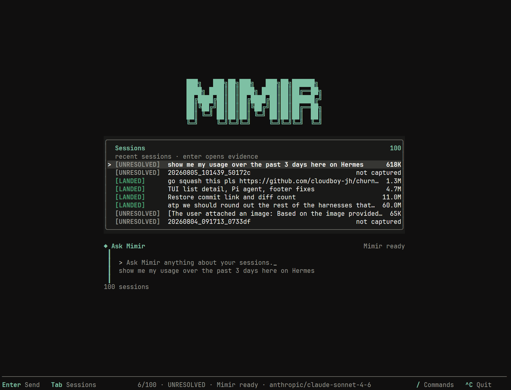

<p align="center">
  
</p>

# Private memory for coding agents

Mimir records what your coding agents attempted, which models and files were
involved, what failed, and whether the work actually landed. The Worker,
storage, and private dashboard run inside your Cloudflare account.

```bash
go run github.com/cloudboy-jh/mimir/cmd/mimir@latest install
mimir setup
```

Setup provisions D1 and R2, builds and deploys the Worker and dashboard, stores
your OpenRouter key through a masked prompt, and connects the current machine.

Requirements: a Cloudflare account, an OpenRouter API key, Go 1.25+, Node.js 22
with npm, and Bun. To connect another machine to the same deployment, install
the CLI there and run `mimir login`.

## Dashboard and terminal

The private dashboard keeps sessions, outcomes, capture state, harnesses, models,
and token usage visible in one place.


The persistent TUI provides the same session-first workflow in the terminal,
with inline evidence and Ask Mimir for questions grounded in your saved work.

<p align="center">
  
</p>

## What Mimir remembers

A session is one episode of agent work, not a bag of disconnected requests.
Mimir reconstructs the session so you can see:

- the task, repository, app, models, duration, and token use;
- full redacted proxy exchanges and bounded exchanges reconstructed by
  supported harness integrations;
- supporting runs, tool-touched files, real error signals, and model switches;
- whether durable capture succeeded;
- whether the work landed, was discarded, was abandoned, or remains unresolved.

That makes prior work useful before the next attempt:

```text
Search: "token validation"

Previous session
  outcome     discarded
  models      gpt-5.6-sol, claude-opus-5
  files       auth.ts, proxy.ts
  error       token validation failed

Result: the next agent avoids the same dead end.
```

Mimir deliberately keeps two facts separate:

- **Capture state** describes durable memory: Empty, Pending, Saved, Failed, or
  Partial.
- **Work outcome** describes the result: Landed, Discarded, Abandoned, or
  Unresolved.

## How Mimir works


There are three inputs to one session record:

1. **Proxied model traffic** carries complete OpenRouter requests and streaming
   responses. The Worker preserves streaming, redacts the exchange, writes the
   full object to R2, and indexes searchable metadata in D1.
2. **Reconstructed harness exchanges** carry the completed prompt and response
   fields exposed by OpenCode, Claude Code, Codex, or Cursor. The Worker redacts
   and persists them like other exchanges, but they are bounded reconstructions,
   not provider transport archives.
3. **Harness events** carry turn summaries, heartbeats, titles, session ends,
   and evidenced work outcomes. They keep sessions live. Hermes direct-provider
   capture is event-only and does not create searchable exchange objects.

`x-mimir-session` is the authoritative session boundary when available. Traffic
without an exact session ID uses bounded inactivity grouping.

| Traffic path | Durable capture | Session lifecycle | Searchable exchange metadata |
| --- | --- | --- | --- |
| Redirected OpenRouter | Full redacted transport exchange | Yes | Yes |
| OpenCode OAuth, subscription, or direct provider | Bounded reconstruction from the OpenCode session store | Plugin events | Yes, after persistence succeeds |
| Claude Code, Codex, or Cursor supported hooks | Bounded prompt/response reconstruction | Hook events | Yes, after persistence succeeds |
| Hermes Nous portal, OAuth, or direct provider | Event-only turn summary | Plugin events | No |
| Other tools using Mimir proxy URLs | Full redacted transport exchange | Capture events only | Yes |

Hermes' managed OpenRouter route suppresses duplicate plugin turns for known
proxied requests. A scheduled capture response only means persistence was
queued. `mimir session status` is the authority for durable capture.

## Use the memory

Search before starting another attempt:

```bash
mimir search "token validation" --json
```

Inspect a complete session record:

```bash
mimir session get <id> --json
```

Verify durable capture:

```bash
mimir session status <id> --json
```

Record an evidenced result:

```bash
mimir session outcome <id> landed --reason "merged in PR 42"
```

Open the private dashboard:

```bash
mimir dashboard
```

The dashboard leads with sessions. Requests remain supporting evidence, one
click away when you need the raw record.

## Connect an agent

### OpenCode

The installer manages the Mimir plugin and skills without rewriting general
OpenCode JSON or JSONC. OpenRouter exchanges remain canonical at the proxy; for
other providers, the plugin uploads bounded reconstructed exchanges from
OpenCode's session store. It also reports lifecycle events, titles, model
switches, and Git outcome evidence. Restart OpenCode after an install or update.
See [OpenCode capture setup](docs/opencode-capture-setup.md).

### Hermes desktop and TUI

Mimir redirects Hermes' built-in OpenRouter provider through `/v1/hermes` and
enables a plugin for direct-provider turn summaries and lifecycle events. Those
direct-provider summaries are event-only; they do not contain request/response
bodies or create searchable exchanges. Restart Hermes after an install or
update. See [Hermes capture setup](docs/hermes-capture-setup.md).

### Claude Code, Codex, and Cursor

The installer enrolls receipt-owned hook manifests in each harness's supported
location. Their start, prompt, completion, and end hooks invoke the hidden
`mimir _hook` adapter, which reconstructs bounded prompt/assistant exchanges and
queues delivery when the Worker is unavailable. Existing different hook files
are preserved as conflicts rather than merged or overwritten. Restart the named
harness after installation or update.

### Other harnesses and tools

```bash
mimir connection
```

The connection manifest supplies proxy base URLs, credential sources, and
supported metadata headers. The CLI inspects and controls memory; it does not
capture unrelated model traffic.

### Session titles

Titles are first-class session metadata, separate from the original task intent.
The displayed title falls back through `title`, `intent`, then session ID. A
manual dashboard title has highest precedence, followed by a title reported by
the harness, a saved generated title exchange, and the first saved primary user
intent. Lower-precedence sources cannot overwrite a stronger title.

## Your account, your data

There is no Mimir account, hosted backend, shared memory service, or browser
machine-token storage.

- The Worker and dashboard run in your Cloudflare account.
- Redacted proxy and reconstructed harness exchanges live in R2.
- Searchable metadata, configuration, and lifecycle state live in D1.
- A Session Durable Object coordinates liveness, retries, reopening, and
  transcript finalization.
- Dashboard APIs and redacted-log routes require verified Cloudflare Access
  JWTs. Machine APIs use independent per-machine bearer tokens.
- Local code recall stays in `<repo>/.mimir/index.json` and is never uploaded.

Redaction runs before R2 persistence and excerpt generation. It reduces
accidental retention, but it cannot guarantee removal of every secret.

## Command reference

```text
mimir install                         reconcile managed local artifacts
mimir setup [--quick]                 provision and deploy Mimir
mimir login                           connect another machine
mimir deploy [--worker-dir DIR]       deploy packaged Worker and dashboard changes
mimir dashboard                       open the private dashboard
mimir tui                             open the persistent sessions + agent terminal
mimir list [filters] [--json]         browse recent sessions (interactive on a TTY)
mimir search <query> [--json]         search saved session memory
mimir session get <id> [--json]       inspect one session
mimir session status <id> [--json]    verify durable capture
mimir session end <id> [--json]       finalize the active generation
mimir session outcome <id> <value>    record an evidenced work outcome
mimir doctor [--json] [--tui]         validate deployment, integrations, and optional TUI prerequisites
mimir update [--check]                update Mimir and managed integrations
mimir uninstall [--keep-binary]       remove verified managed artifacts
```

Deploy only with `mimir deploy`. The packaged Worker and dashboard are always
the default source; arbitrary source requires explicit `--worker-dir <path>`.
Run `mimir help advanced` for code recall, connection, configuration, and
diagnostic commands.

`mimir install` creates or reconciles only receipt-managed integrations.
`mimir setup` and `mimir login` refresh them only when a managed installation
receipt already exists; they do not silently enroll global hook files. Updates
preserve unowned or locally modified files and do not deploy the Worker.

## Validation

From the repository root, validate the capture and installer surfaces with:

```bash
npm --prefix worker test -- src/config.test.ts src/session-titles.test.ts
bun test plugins/opencode/
python -m unittest discover -s plugins/hermes -p "test_*.py"
go test ./internal/harness/hooks ./internal/install ./internal/doctor
npm --prefix worker run typecheck
```

These are local tests only. Deployment verification must use `/whoami` and
direct session APIs; it must not invoke paid model routes.

## Dashboard development

Run the dashboard against the deterministic development dataset:

```bash
npm --prefix worker ci
bun --cwd=worker/web install --frozen-lockfile
bun run dev
```

The fixture dataset covers multi-model sessions, supporting runs, commits,
diffs, errors, outcome history, and empty states. It runs Vite with HMR on
`127.0.0.1:5173` without requiring local Cloudflare bindings.

Use `bun run dev:live` to apply local D1 migrations and run the dashboard
against the Worker on `127.0.0.1:8787`. Vite proxies the Access handoff,
dashboard APIs, and log-object requests to the Worker. Local requests use the
clearly marked development identity and never require browser machine
credentials.

## Documentation

- [Installation and managed-file ownership](docs/installation.md)
- [CLI and machine-readable contract](docs/cli.md)
- [Session lifecycle and capture boundaries](docs/session-lifecycle.md)
- [Implementation, APIs, storage, and security](docs/Spec.md)
- [Operations](docs/operations.md) and [troubleshooting](docs/troubleshooting.md)
- [Product direction](docs/PRODUCT.md) and [dashboard design](docs/DESIGN.md)
