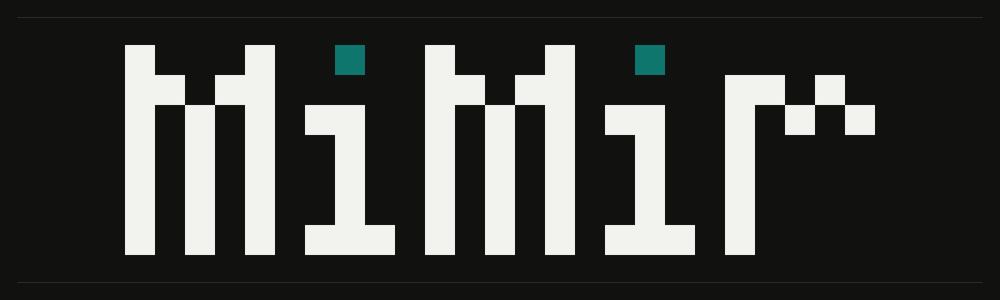
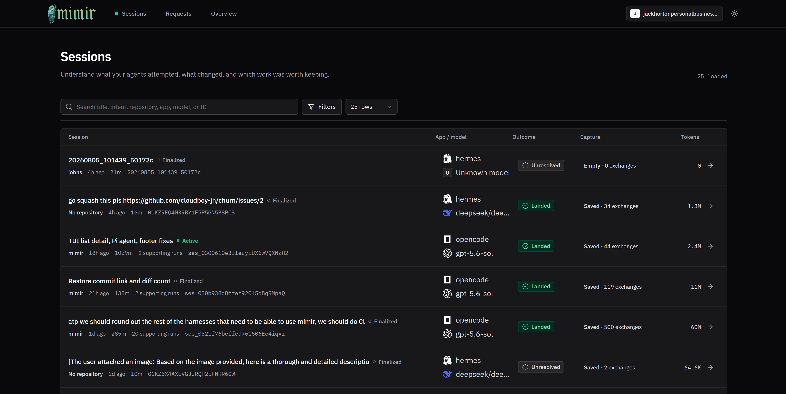
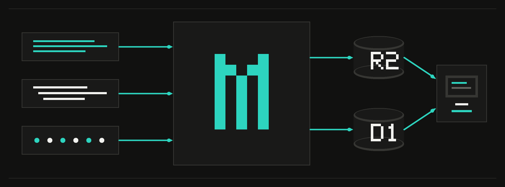

<p align="center">
  
</p>

# Private memory for coding agents

Mimir records what your coding agents attempted, which models and files were
involved, what failed, and whether the work actually landed. The Worker,
storage, and private dashboard run inside your Cloudflare account.

## Start here

Install the latest checksum-verified release:

```bash
curl -fsSL https://raw.githubusercontent.com/cloudboy-jh/mimir/master/install.sh | sh
```

Windows PowerShell:

```powershell
irm https://raw.githubusercontent.com/cloudboy-jh/mimir/master/install.ps1 | iex
```

### Try it locally

Explore the dashboard with synthetic data before deploying anything:

```bash
mimir demo
```

The demo binds only to loopback, opens in your browser, and requires no
Cloudflare account, connection, model credentials, Node.js, Bun, or Go.

### Create a deployment

A fresh deployment needs a Cloudflare account, an OpenRouter API key, Node.js
22 with npm, and network access to npm and Cloudflare. It does not need Bun, Go,
or a source checkout.

```bash
mimir setup
```

Setup deploys the embedded Worker and production dashboard, creates or reuses
D1 and R2, applies migrations, registers this machine, and stores the OpenRouter
key as a Worker secret. It reads `OPENROUTER_API_KEY` first, reuses an existing
Worker secret when present, or asks through a masked interactive prompt.
Cloudflare Access configuration is optional and can be completed later with
`mimir access`.

### Connect another machine

Install the CLI on the other machine, then run:

```bash
mimir login
```

Discovery login needs Node.js 22 with npm/npx and Cloudflare access to the
account containing the deployment. It does not need the OpenRouter key, Bun, Go,
or dashboard build dependencies. An already healthy local connection takes a
fast path without Cloudflare discovery. See [installation and connection
paths](docs/installation.md) for direct URL/token recovery.

### Verify the first session

1. Run `mimir doctor --json` and apply the harness activation action it prints.
2. Run `mimir doctor --json` again and resolve every failed check.
3. Start a normal coding-agent session and send one real prompt.
4. Find it with `mimir list --json` or open it with `mimir dashboard`.
5. Confirm durable persistence with `mimir session status <id> --json`.

Use `/whoami` and direct session APIs for deployment health checks. Do not call
`/v1/chat/completions`, `/v1/messages`, or another paid model route just to test
connectivity.

## Dashboard and agents

The private dashboard keeps sessions, outcomes, capture state, harnesses, models,
and token usage visible in one place.



Installed agents use the `mimir-use` skill and machine-readable CLI to query
memory directly. Ask the agent for recent sessions, prior decisions, or evidence;
it runs Mimir commands itself and presents readable results rather than raw JSON.
Pi's managed extension routes OpenRouter through Mimir with exact session headers
and reports bounded reconstructed turns for providers that bypass the proxy.

## What Mimir remembers

A session is one episode of agent work, not a bag of disconnected requests.
Mimir reconstructs the session so you can see:

- the task, repository, app, models, duration, and token use;
- full redacted proxy exchanges and bounded exchanges reconstructed by
  supported harness integrations;
- supporting runs, tool-touched files, real error signals, and model switches;
- whether durable capture succeeded;
- whether the work landed, was discarded, was abandoned, or remains unresolved.

That makes prior work useful before the next attempt:

```text
Search: "token validation"

Previous session
  outcome     discarded
  models      gpt-5.6-sol, claude-opus-5
  files       auth.ts, proxy.ts
  error       token validation failed

Result: the next agent avoids the same dead end.
```

Mimir deliberately keeps two facts separate:

- **Capture state** describes durable memory: Empty, Pending, Saved, Failed, or
  Partial.
- **Work outcome** describes the result: Landed, Discarded, Abandoned, or
  Unresolved.

## How Mimir works



There are three inputs to one session record:

1. **Proxied model traffic** carries complete OpenRouter requests and streaming
   responses. The Worker preserves streaming, redacts the exchange, writes the
   full object to R2, and indexes searchable metadata in D1.
2. **Reconstructed harness exchanges** carry the completed prompt and response
   fields exposed by Pi, OpenCode, Claude Code, Codex, or Cursor. The Worker redacts
   and persists them like other exchanges, but they are bounded reconstructions,
   not provider transport archives.
3. **Harness events** carry turn summaries, heartbeats, titles, session ends,
   and evidenced work outcomes. They keep sessions live. Hermes direct-provider
   capture is event-only and does not create searchable exchange objects.

`x-mimir-session` is the authoritative session boundary when available. Traffic
without an exact session ID uses bounded inactivity grouping.

Each installed device also has a stable `installation_id`, separate from its
editable display name. Sessions retain that device association. The dashboard's
Devices settings lists, renames, and revokes devices; revocation blocks future
machine and installation-scoped Hermes authentication without deleting history.

| Traffic path | Durable capture | Session lifecycle | Searchable exchange metadata |
| --- | --- | --- | --- |
| Redirected OpenRouter | Full redacted transport exchange | Yes | Yes |
| Pi direct or subscription provider | Bounded reconstruction from the completed Pi turn | Extension events | Yes, after persistence succeeds |
| OpenCode OAuth, subscription, or direct provider | Bounded reconstruction from the OpenCode session store | Plugin events | Yes, after persistence succeeds |
| Claude Code, Codex, or Cursor supported hooks | Bounded prompt/response reconstruction | Hook events | Yes, after persistence succeeds |
| Hermes Nous portal, OAuth, or direct provider | Event-only turn summary | Plugin events | No |
| Other tools using Mimir proxy URLs | Full redacted transport exchange | Capture events only | Yes |

Hermes' managed OpenRouter route suppresses duplicate plugin turns for known
proxied requests. A scheduled capture response only means persistence was
queued. `mimir session status` is the authority for durable capture.

## Use the memory

Search before starting another attempt:

```bash
mimir search "token validation" --json
```

Inspect a complete session record:

```bash
mimir session get <id> --json
```

Verify durable capture:

```bash
mimir session status <id> --json
```

Record an evidenced result:

```bash
mimir session outcome <id> landed --reason "merged in PR 42"
```

Open the private dashboard:

```bash
mimir dashboard
```

The dashboard leads with sessions. Requests remain supporting evidence, one
click away when you need the raw record.

## Connect an agent

### Pi

The installer manages a global Pi extension and the shared Mimir skill. The
extension routes Pi's OpenRouter provider through Mimir with exact session,
repository, and harness headers. For direct and subscription providers it
uploads bounded reconstructed completed turns, including tool results exposed
by Pi. Restart Pi after install or update. Ask Pi for Mimir memory normally;
the skill runs the machine-readable CLI and formats results.

### Oh My Pi

Oh My Pi is selected independently under the Pi group during setup. Mimir
installs its adapter at `~/.omp/agent/extensions/mimir.ts` (or the active OMP
profile), activates exact lifecycle heartbeats on the first real turn, and
captures OpenRouter plus bounded direct-provider evidence. Idle drafts do not
create dashboard sessions. Restart `omp` after install or update. Use
`OMP_CODING_AGENT_DIR` when OMP has a nonstandard agent home.

### OpenCode

The installer manages the Mimir plugin and skills without rewriting general
OpenCode JSON or JSONC. OpenRouter exchanges remain canonical at the proxy; for
other providers, the plugin uploads bounded reconstructed exchanges from
OpenCode's session store. It also reports lifecycle events, titles, model
switches, and Git outcome evidence. Restart OpenCode after an install or update.
See [OpenCode capture setup](docs/opencode-capture-setup.md).

### Hermes desktop and TUI

Mimir redirects Hermes' built-in OpenRouter provider through the installation-scoped
`/v1/hermes/<installation-id>` route and
enables a plugin for direct-provider turn summaries and lifecycle events. Those
direct-provider summaries are event-only; they do not contain request/response
bodies or create searchable exchanges. Restart Hermes after an install or
update. See [Hermes capture setup](docs/hermes-capture-setup.md).

### Claude Code, Codex, and Cursor

The installer enrolls receipt-owned hook manifests in each harness's supported
location. Their start, prompt, completion, and end hooks invoke the hidden
`mimir _hook` adapter, which reconstructs bounded prompt/assistant exchanges and
queues delivery when the Worker is unavailable. Existing different hook files
are preserved as conflicts rather than merged or overwritten. Claude Code uses
`/reload-plugins` or a restart; Codex requires a restart; Cursor reloads
`hooks.json` when you open or continue an agent session.

### Other harnesses and tools

```bash
mimir connection
```

The connection manifest supplies proxy base URLs, credential sources, and
supported metadata headers. The CLI inspects and controls memory; it does not
capture unrelated model traffic.

### Session titles

Titles are first-class session metadata, separate from the original task intent.
The displayed title falls back through `title`, `intent`, then session ID. A
manual dashboard title has highest precedence, followed by a title reported by
the harness, a saved generated title exchange, and the first saved primary user
intent. Lower-precedence sources cannot overwrite a stronger title.

## Your account, your data

There is no Mimir account, hosted backend, shared memory service, or browser
machine-token storage.

- The Worker and dashboard run in your Cloudflare account.
- Redacted proxy and reconstructed harness exchanges live in R2.
- Searchable metadata, configuration, and lifecycle state live in D1.
- A Session Durable Object coordinates liveness, retries, reopening, and
  transcript finalization.
- Dashboard APIs and redacted-log routes require verified Cloudflare Access
  JWTs. Machine APIs use independent per-machine bearer tokens.
- Local code recall stays in `<repo>/.mimir/index.json` and is never uploaded.

### Cloudflare Free plan usage

Mimir uses account-level Workers, D1, R2, Durable Objects, and optional Access.
As of August 2026, Cloudflare documents these Free plan units:

| Product | Included usage relevant to Mimir |
| --- | --- |
| Workers | 100,000 requests/day; 10 ms CPU/invocation |
| D1 | 5 million rows read/day; 100,000 rows written/day; 5 GB total storage |
| R2 Standard | 10 GB-month/month; 1 million Class A and 10 million Class B operations/month; free egress |
| SQLite Durable Objects | 100,000 requests/day; 13,000 GB-s/day; 5 million rows read and 100,000 rows written/day; 5 GB total storage |

These are shared account limits, not a promise that every workload remains
free. Daily metered operations can fail after their limit is reached. Check the
current [Workers](https://developers.cloudflare.com/workers/platform/pricing/),
[D1](https://developers.cloudflare.com/d1/platform/pricing/),
[R2](https://developers.cloudflare.com/r2/pricing/), and [Durable
Objects](https://developers.cloudflare.com/durable-objects/platform/pricing/)
pricing pages before relying on the numbers.

Redaction runs before R2 persistence and excerpt generation. It reduces
accidental retention, but it cannot guarantee removal of every secret.

## Command reference

```text
mimir install --harness <id|all>      install selected harness integrations
mimir harness                         inspect or change detected harnesses
mimir enable|disable <name>           toggle Pi, OpenCode, or Hermes quickly
mimir setup                           provision and deploy Mimir
mimir login                           connect another machine
mimir demo [--no-open]                explore sample sessions locally
mimir deploy [--worker-dir DIR]       deploy packaged Worker and dashboard changes
mimir dashboard                       open the private dashboard
mimir list [filters] [--json]         list recent sessions
mimir search <query> [--json]         search saved session memory
mimir session get <id> [--json]       inspect one session
mimir session status <id> [--json]    verify durable capture
mimir session end <id> [--json]       finalize the active generation
mimir session outcome <id> <value>    record an evidenced work outcome
mimir doctor [--json]                 validate deployment and integrations
mimir update [--check]                update Mimir and managed integrations
mimir uninstall [--keep-binary]       remove verified managed artifacts
```

Deploy only with `mimir deploy`. The packaged Worker and dashboard are always
the default source; arbitrary source requires explicit `--worker-dir <path>`.
Run `mimir help advanced` for code recall, connection, configuration, and
diagnostic commands.

`mimir install` accepts repeatable `--harness <id>` flags in canonical order:
OpenCode, Pi, Oh My Pi, Hermes, Claude Code, Codex, and Cursor. Use `--harness all` for
every integration. Interactive installs without flags prompt once and default
to detected harnesses; JSON and other noninteractive installs require explicit
selection. Run `mimir harness` in a terminal to see selected and detected
integrations, move with the arrow keys, toggle `●`/`○` with Space, and apply
with Enter. `mimir harness --json` remains noninteractive. `mimir enable` and
`mimir disable` are case-insensitive shortcuts for Pi, OpenCode, and Hermes;
other integrations remain available through `mimir harness`. Removal deletes
only unmodified receipt-owned files and preserves modified files and their
ownership records.

`mimir install` creates or reconciles only selected receipt-managed
integrations. For Pi, it installs `~/.pi/agent/extensions/mimir.ts` (or
`$PI_CODING_AGENT_DIR/extensions/mimir.ts`); restart Pi to activate it.
`mimir setup` and `mimir login` refresh integrations only when a managed installation
receipt already exists; they do not silently enroll global hook files. Updates
preserve unowned or locally modified files and do not deploy the Worker.

## Validation

From the repository root, validate the capture and installer surfaces with:

```bash
npm --prefix worker test -- src/config.test.ts src/session-titles.test.ts
bun test plugins/pi/ plugins/opencode/
python -m unittest discover -s plugins/hermes -p "test_*.py"
go test ./internal/harness/hooks ./internal/install ./internal/doctor
npm --prefix worker run typecheck
```

These are local tests only. Deployment verification must use `/whoami` and
direct session APIs; it must not invoke paid model routes.

## Dashboard development

Run the dashboard against the deterministic development dataset:

```bash
npm --prefix worker ci
bun --cwd=worker/web install --frozen-lockfile
bun run dev
```

The fixture dataset covers multi-model sessions, supporting runs, commits,
diffs, errors, outcome history, and empty states. It runs Vite with HMR on
`127.0.0.1:5173` without requiring local Cloudflare bindings.

Use `bun run dev:live` to apply local D1 migrations and run the dashboard
against the Worker on `127.0.0.1:8787`. Vite proxies the Access handoff,
dashboard APIs, and log-object requests to the Worker. Local requests use the
clearly marked development identity and never require browser machine
credentials.

## Documentation

- [Installation and managed-file ownership](docs/installation.md)
- [CLI and machine-readable contract](docs/cli.md)
- [Session lifecycle and capture boundaries](docs/session-lifecycle.md)
- [Implementation, APIs, storage, and security](docs/Spec.md)
- [Operations](docs/operations.md) and [troubleshooting](docs/troubleshooting.md)
- [Product direction](docs/PRODUCT.md) and [dashboard design](docs/DESIGN.md)
