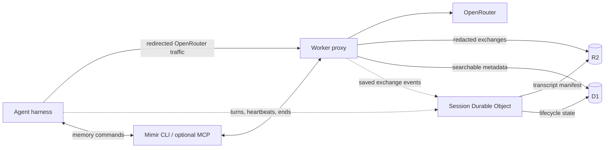

# Mimir


**Durable session memory for coding agents.**

Mimir is a private, self-hosted memory plane in your Cloudflare account. It
combines full exchange capture for redirected OpenRouter traffic with
harness-level turn and lifecycle reporting for supported OAuth, subscription,
and direct-provider paths. Agents search and control that memory through the
CLI, optional MCP, and a private dashboard.

No Mimir account. No hosted backend. No shared memory service.

## Why

Agents forget previous attempts, diagnosed errors, relevant files, and fixes
that actually shipped. Mimir lets them search that work before starting over.

```text
Agent searches Mimir before changing authentication.

Mimir finds:
- a discarded attempt with the same token-validation error
- the files and exchanges involved
- the approach that failed

Agent avoids repeating it.
```

Capture state says whether memory was saved. Outcome says whether the work
landed, was discarded, was abandoned, or remains unresolved.

## How It Works


```mermaid
flowchart LR
    H[Agent harness] -->|redirected OpenRouter traffic| W[Worker proxy]
    W --> O[OpenRouter]
    W -->|redacted exchanges| R[(R2)]
    W -->|searchable metadata| D[(D1)]
    H -.->|turns, heartbeats, ends| S[Session Durable Object]
    W -.->|saved exchange events| S
    S -->|transcript manifest| R
    S -->|lifecycle state| D
    H <-->|memory commands| C[Mimir CLI / optional MCP]
    C <--> W
```

1. **Worker proxy:** streams redirected OpenRouter traffic and writes full
   redacted exchanges to R2 with searchable metadata in D1.
2. **Harness plugins:** report completed-turn summaries and lifecycle events
   across harness providers. Hermes suppresses turns known to have traversed
   the proxy. Plugin summaries are not full request/response archives.
3. **Session Durable Object:** owns live lifecycle, liveness, the bounded plugin
   turn feed, reopening, and transcript finalization. R2 and D1 remain
   canonical for saved proxy exchanges, searchable metadata, and finalized
   lifecycle state.

## Session Lifecycle

Sessions start lazily. There is no separate start command.

A session starts from the first activity carrying its session ID:

1. Harness start hook sends a heartbeat.
2. First completed turn arrives if the start hook was missed.
3. First capture-eligible proxied request carrying `x-mimir-session` is saved.

Sessions finalize three ways:

1. A supported harness finalize hook sends an end event. OpenCode sends this
   for `session.deleted`; ordinary process exit falls back to silence timeout.
2. Approximately ten minutes of silence triggers the Durable Object alarm.
3. The user or agent explicitly ends it through CLI or MCP.

Reopening is intentional:

- Finalization is not a tombstone.
- New activity with the same session ID reopens the same session.
- Existing history remains attached.
- A genuinely new harness session receives a new ID.
- Repeated end requests remain safe.
- Finalization failures schedule retries.
- Liveness is derived independently as `active`, `disconnected`, or `finalized`.

`active` means activity arrived within about 90 seconds. `disconnected` means
the session is silent but its finalization alarm has not fired. `finalized`
means the final transcript and lifecycle write completed. The ten-minute
silence timer is a durability backstop, not a liveness promise.

```text
Saved to Mimir · 14 exchanges in this session · View session
```

## Install

Requirements: Cloudflare account, OpenRouter API key, Go 1.25+, Node.js 22
with npm, and Bun.

```bash
go run github.com/cloudboy-jh/mimir/cmd/mimir@latest install
mimir setup
```

Connect another machine to an existing deployment:

```bash
go run github.com/cloudboy-jh/mimir/cmd/mimir@latest install
mimir login
```

Setup materializes the embedded Worker and dashboard, provisions or discovers
D1 and R2, stores the OpenRouter key through a masked prompt, deploys, and
registers a per-machine token. Mimir changes only exact receipt-owned plugin
and skill files, preserves conflicts and local edits, and never rewrites
general OpenCode configuration. See [the specification](docs/Spec.md) for the
full ownership contract.

The embedded Worker is always the default source, even when commands run from a
Mimir checkout. Development or arbitrary source requires explicit
`--worker-dir <path>`.

## Connect An Agent

### OpenCode

The installer manages the exact global Mimir plugin and skills. The plugin
reports turns and lifecycle events and injects the receipt-owned optional MCP
command at startup without rewriting JSON/JSONC. Restart OpenCode after an
install or update. [OpenCode details](docs/opencode-capture-setup.md).

### Hermes desktop and TUI

Mimir redirects Hermes' built-in OpenRouter provider through `/v1/hermes` and
enables a plugin for direct-provider turns and lifecycle events. The plugin
suppresses duplicate turn reporting for known proxied requests. Restart Hermes
after an install or update. [Hermes details](docs/hermes-capture-setup.md).

### Other harnesses

```bash
mimir connection
```

The manifest supplies base URLs, credential sources, the optional MCP command,
and supported metadata-header names.

## Commands

```bash
mimir install [--bin-dir DIR]        # reconcile managed local artifacts
mimir setup [--quick]                # provision and deploy the memory plane
mimir login                          # connect another machine
mimir deploy [--worker-dir DIR]      # deploy packaged Worker/dashboard changes
mimir access [--email ADDRESS]       # create or repair dashboard Access
mimir dashboard                      # open the dashboard
mimir list [--repo NAME] [--json]    # list recent sessions
mimir search <query> [--json]        # search session memory
mimir session get <id> [--json]      # read one session
mimir session status <id> [--json]   # verify durable capture
mimir session end <id> [--json]      # finalize the active generation
mimir session outcome <id> <value>   # record an evidenced outcome
mimir tools --json                   # print the agent command/tool schemas
mimir reconcile                      # check bounded D1/R2 consistency
mimir doctor [--json]                # validate connection and integrations
mimir update [--check]               # update CLI and managed integrations
mimir uninstall [--keep-binary]      # remove verified managed artifacts
mimir version [--json]               # build and managed-install summary
```

CLI commands are the primary agent surface. `mimir serve` exposes equivalent
MCP tools for harnesses that prefer MCP. Existing `mimir session <id>` and MCP
tool names remain compatibility aliases. Run `mimir help advanced` for local
index, recall, connection, config, and diagnostic commands.

Deploy only with `mimir deploy`; the checked-in Wrangler configuration contains
a placeholder D1 ID by design.

## Dashboard, Data, And Authentication

`mimir dashboard` opens `/dashboard`. Sessions are primary; requests are
supporting evidence. Browser APIs and R2 reads require verified Cloudflare
Access JWTs. Machine APIs use per-machine bearer tokens and remain outside
Access. Browser code never stores a machine token.

- Redaction runs before R2 persistence and excerpt generation.
- Full proxy exchanges live in R2; searchable metadata lives in D1.
- Transcript manifests live at `sessions/<id>/transcript.json`.
- Local code recall stays in `<repo>/.mimir/index.json` and is never uploaded.
- Redaction reduces accidental retention; it cannot guarantee removal of every secret.

## Documentation

- [Implementation, APIs, storage, and security](docs/Spec.md)
- [Installation](docs/installation.md), [CLI contract](docs/cli.md), [operations](docs/operations.md), and [troubleshooting](docs/troubleshooting.md)
- [Session lifecycle contract](docs/session-lifecycle.md)
- [OpenCode](docs/opencode-capture-setup.md) and [Hermes](docs/hermes-capture-setup.md) integrations
- [Product direction](docs/PRODUCT.md) and [dashboard design](docs/DESIGN.md)
