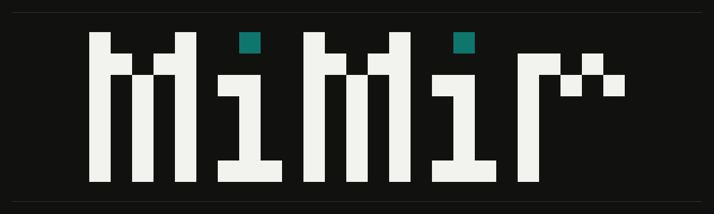
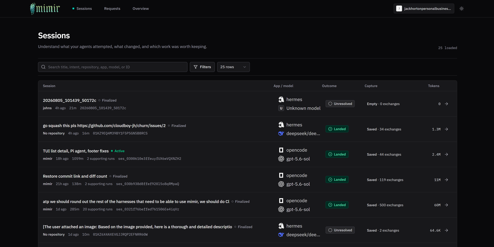
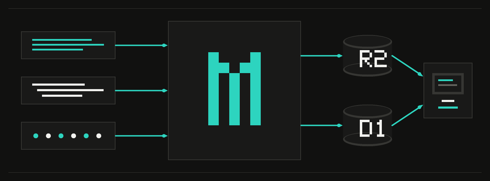

<p align="center">
  
</p>

# Private memory for coding agents

Mimir records what your coding agents attempted, which models and files were
involved, what failed, and whether the work landed. The Worker, storage, and
private dashboard run inside your Cloudflare account. Agents can search prior
sessions before trying the same approach again.

## Get started

Install the latest checksum-verified release. During installation, select the
coding agent you use so Mimir can install its integration.

macOS and Linux:

```bash
curl -fsSL https://raw.githubusercontent.com/cloudboy-jh/mimir/master/install.sh | sh
```

Windows PowerShell:

```powershell
irm https://raw.githubusercontent.com/cloudboy-jh/mimir/master/install.ps1 | iex
```

Want to look around first? `mimir demo` opens a local dashboard with synthetic
sessions. It needs no Cloudflare account, connection, model credentials,
Node.js, Bun, or Go. Demo changes reset on reload; it does not capture your work.

### Capture your first session

A fresh deployment requires a Cloudflare account, an OpenRouter API key,
Node.js 22 with npm, and network access to npm and Cloudflare. You do not need
Bun, Go, or a source checkout.

```bash
mimir setup
```

Setup deploys the embedded Worker and dashboard, provisions D1 and R2, registers
this machine, and stores the OpenRouter key as a Worker secret. It reads
`OPENROUTER_API_KEY` first, reuses an existing Worker secret, or asks through a
masked prompt. If the installer did not enroll your agent, run `mimir install`
and select it; setup does not silently add integrations.

Activate the integration: restart Pi, Oh My Pi, OpenCode, Hermes, or Codex;
reload Claude Code with `/reload-plugins` or restart it; for Cursor, open or
continue an agent session. Then check the deployment and active integration:

```bash
mimir doctor --json
```

Resolve any failed checks using the reported action. In the activated agent,
start a normal session and send a real prompt. Then find its ID and check that
its capture was saved:

```bash
mimir list --json
mimir session status <id> --json
```

The status receipt is the authority for durable capture. A successful model
response or a queued capture does not prove the exchange was saved. Do not use
a paid model route merely to test deployment connectivity. See [installation
and first-session verification](docs/installation.md) if you need the exact
activation or recovery steps.

### Open the private dashboard

Cloudflare Access is optional during setup, but required to use the deployed
private dashboard in a browser. If you did not configure it during setup, run:

```bash
mimir access
mimir dashboard
```

The dashboard leads with sessions, outcomes, and capture state; requests are
supporting evidence. It also shows harnesses, models, provider-reported cache
reads and writes, and token usage.



## Use the memory

Ask an installed agent for recent sessions, prior decisions, or evidence. The
`mimir-use` skill queries the machine-readable CLI and presents readable
results instead of raw JSON. Pi and Oh My Pi expose the exact active session as
`MIMIR_SESSION_ID`; OpenCode supplies native status and outcome tools. After
meaningful work, the skill records an evidenced outcome before fetching the
capture receipt.

You can also search and inspect sessions yourself:

```bash
mimir search "token validation" --json
mimir session get <id> --json
mimir session outcome <id> landed --reason "merged in PR 42"
```

Mimir keeps **capture state** (Empty, Pending, Saved, Failed, or Partial)
separate from **work outcome** (Landed, Discarded, Abandoned, or Unresolved).
A saved exchange does not mean the work landed. Sessions can retain independent
Git patches across commits even when work was discarded or abandoned.

To recover supported local Pi or OpenCode history, run `mimir import` in a
terminal. Use `mimir backfill` to repair gaps. See [import and backfill
commands](docs/cli.md#local-import-and-backfill) for inspection, confirmation,
and noninteractive forms.

## What gets captured

A session is one episode of agent work, not a bag of disconnected requests.
Mimir combines model exchanges, harness lifecycle events, and Git evidence so
you can inspect the task, repository, models, files, errors, and result.

| Path | Evidence |
| --- | --- |
| OpenRouter traffic routed through Mimir | Full redacted request and response, including streamed responses |
| Pi, Oh My Pi, OpenCode, Claude Code, Codex, and Cursor direct or subscription paths | Bounded prompt and response reconstructions where supported; not provider transport archives |
| Hermes direct providers | Event-only turn summaries; no searchable exchange bodies |

`x-mimir-session` is the authoritative session boundary when available. Traffic
without an exact ID uses bounded inactivity grouping. The Worker redacts before
writing full exchanges and imported Git patches to R2; searchable metadata and
R2 references live in D1. Redaction reduces accidental retention but cannot
guarantee that every secret is removed. Local code recall stays in
`<repo>/.mimir/index.json` and is not uploaded.



There is no Mimir account or hosted backend. Machine requests use per-machine
bearer tokens; deployed dashboard APIs and redacted logs require verified
Cloudflare Access JWTs. Mimir uses your account's shared Cloudflare allowances,
not a dedicated free quota. See [capture fidelity and Free plan
units](docs/installation.md#capture-fidelity) and [session lifecycle and capture
boundaries](docs/session-lifecycle.md) for the detailed guarantees.

## More paths

- **Another machine:** Install Mimir there, then run `mimir login`. Discovery
  requires Node.js 22 with npm/npx and access to the Cloudflare account, but
  not the OpenRouter key. [Direct URL/token recovery](docs/installation.md#direct-url-and-token)
  is also available.
- **Other model clients:** Run `mimir connection` for proxy URLs, credential
  sources, and supported metadata headers. The CLI itself does not capture
  unrelated model traffic.
- **Operations:** [Deploy, diagnose, update, Access, and devices](docs/operations.md)
  · [Troubleshooting](docs/troubleshooting.md)
- **Reference:** [CLI and machine-readable contract](docs/cli.md) ·
  [Implementation, APIs, storage, and security](docs/Spec.md) ·
  [Product direction](docs/PRODUCT.md) · [Dashboard design](docs/DESIGN.md)
- **Development:** [Dashboard and Worker development](docs/operations.md#local-development)
  · [OpenCode capture](docs/opencode-capture-setup.md) ·
  [Hermes capture](docs/hermes-capture-setup.md)
