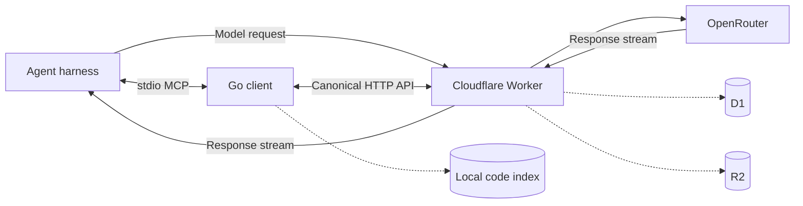

# Mimir v2 Implementation Specification

This document describes the current implementation. Product intent is defined
in [`PRODUCT.md`](PRODUCT.md), dashboard visual direction in
[`DESIGN.md`](DESIGN.md), and installation and usage in the root
[`README.md`](../README.md).

## 1. Purpose

Mimir is a self-hosted memory plane for one developer working across coding
agents, repositories, and machines. It captures model traffic as sessions and
makes that history available through HTTP, CLI, and MCP.

The deployment runs in the developer's Cloudflare account. Mimir has no hosted
backend, account system, multi-user tenancy, or shared memory service.

## 2. System Boundary

One Cloudflare Worker provides:

- OpenAI Chat Completions and Anthropic Messages proxy routes
- Session, search, configuration, and log APIs
- Cloudflare Access-protected dashboard APIs
- Static Vue dashboard assets

The Worker uses:

- **OpenRouter** as the only model upstream
- **D1** for sessions, searchable exchange metadata, configuration, facets,
  and machine-token hashes
- **R2** for complete redacted request/response objects
- **Cloudflare Access** for deployed dashboard API authentication

The Go binary provides setup, login, diagnostics, local code indexing, and the
stdio MCP server. Worker HTTP APIs remain canonical; CLI and MCP are clients of
those APIs.

Local code memory remains `<repo>/.mimir/index.json`. It is never uploaded to
D1 or R2.



## 3. Authentication

### 3.1 Machine Requests

Proxy, canonical API, CLI, and MCP requests use a per-machine token supplied as
either:

```http
Authorization: Bearer <token>
```

or:

```http
x-api-key: <token>
```

Each machine gets an independent random 32-byte token. D1 stores only its
SHA-256 hash, label, creation time, and revocation state. The plaintext token is
stored locally in `~/.mimir/token`, or under `$MIMIR_HOME`, with restrictive
permissions.

Before forwarding model requests, the Worker removes machine credentials and
all `x-mimir-*` metadata, then authenticates upstream using the
`OPENROUTER_API_KEY` Worker secret.

### 3.2 Dashboard Requests

Deployed `/dashboard/api/*` and `/dashboard/log-objects/*` routes require a
verified `Cf-Access-Jwt-Assertion`. Verification uses:

- `DASHBOARD_ACCESS_AUD`
- `DASHBOARD_ACCESS_TEAM_DOMAIN`

Localhost dashboard API requests may bypass Access for development. Static SPA
assets are served separately from dashboard API authentication.

Setup does not currently create a Cloudflare Access application or configure
these variables.

## 4. HTTP API

### 4.1 Proxy

| Method | Route | Behavior |
| --- | --- | --- |
| `POST` | `/v1/chat/completions` | OpenAI-style Chat Completions proxy. |
| `POST` | `/v1/messages` | Anthropic-style Messages proxy. |
| `GET` | `/v1/models` | OpenRouter model-list pass-through. |

These routes do not implement the complete OpenAI or Anthropic API surfaces.

### 4.2 Canonical Machine API

| Method | Route | Behavior |
| --- | --- | --- |
| `GET` | `/whoami` | Return deployment URL and session/exchange counts. |
| `GET` | `/sessions` | List up to 100 recent sessions with optional filters. |
| `GET` | `/sessions/:id` | Return one session, exchanges, files, and errors. |
| `GET` | `/sessions/:id/status` | Return the derived capture summary and human receipt, with a link when Access is configured. |
| `POST` | `/sessions/:id/outcome` | Append an evidenced work-outcome event. |
| `POST` | `/sessions/:id/mark` | Deprecated legacy alias for setting an outcome. |
| `POST` | `/reconcile` | Reconcile bounded D1 capture rows against R2 and report orphans. |
| `POST` | `/search` | Search session metadata and excerpts. |
| `GET` | `/config` | Return defaults merged with persisted configuration. |
| `PUT` | `/config` | Validate and persist a partial configuration update. |
| `GET` | `/log/*` | Read one redacted R2 exchange object. |

Session-list filters include repository, model, outcome, and date range.

### 4.3 Dashboard API

| Method | Route | Behavior |
| --- | --- | --- |
| `GET` | `/dashboard/api/bootstrap` | Return basic request/session totals. |
| `GET` | `/dashboard/api/log` | Cursor-paginated exchange metadata. |
| `GET` | `/dashboard/api/log/:id` | Return one exchange and its log-object URL. |
| `GET` | `/dashboard/log-objects/*` | Return one redacted R2 object. |
| `GET` | `/dashboard/api/sessions` | List recent sessions. |
| `GET` | `/dashboard/api/sessions/:id` | Return session evidence and timeline. |
| `GET` | `/dashboard/api/sessions/:id/status` | Return the derived capture summary. |
| `POST` | `/dashboard/api/sessions/:id/outcome` | Append a user-sourced work-outcome event. |
| `POST` | `/dashboard/api/sessions/:id/mark` | Deprecated legacy alias for setting an outcome. |
| `GET` | `/dashboard/api/overview` | Return aggregate totals and top facets. |

The Vue client remains mock-backed except for an exact unknown session deep
link, which consumes only `/dashboard/api/sessions/:id/status` to show its
capture receipt and outcome.

## 5. Capture Lifecycle

For a supported model request, the Worker:

1. Authenticates the machine token.
2. Reads and bounds the request body at 10 MiB.
3. Parses optional Mimir session metadata.
4. Reads capture configuration and lazily expires stale sessions.
5. Replaces caller credentials with the OpenRouter Worker secret.
6. Sends the request to OpenRouter.
7. Returns the upstream response stream to the caller.
8. Uses a second stream branch and `waitUntil` for persistence.
9. Resolves the session, redacts the request, and records an accepted exchange in D1 while the archive stream is still being consumed.
10. Bounds the captured response at 20 MiB.
11. Parses ordinary JSON or reconstructs server-sent events.
12. Redacts the response and derives searchable evidence.
13. Writes the complete redacted v1 envelope to R2.
14. Finalizes the exchange as saved and updates facets and session aggregates in D1.

Capture can be disabled globally or excluded by repository/model. Excluded
traffic is still proxied but is not persisted.

A response larger than the capture limit can still reach the caller even when
archive persistence fails. A D1 finalization failure after the R2 write leaves
an accepted row that reconciliation can finalize; a failure before D1 accepts
the exchange can leave no durable capture record.

## 6. Redaction And Evidence

Redaction runs before R2 storage and before searchable excerpts are generated.
Built-in patterns cover common API-key, bearer-token, secret, token, and
password forms. `redact.patterns` adds user-defined regular expressions.

Mimir derives:

- Request and response excerpts, capped at 8,000 characters each
- File-like paths, capped at 100 unique values per exchange
- Error signatures, capped at 20 unique values per exchange
- Model, provider, finish reason, token usage, latency, endpoint, harness,
  repository, and machine label

Derivation is regex-based. Redaction reduces accidental retention but cannot
guarantee removal of every secret or sensitive value.

## 7. Sessions

`x-mimir-session` is authoritative when present. It must be a 1-128 character
identifier accepted by the Worker. A declared session can be resumed and
reactivated later.

Without that header, Mimir groups traffic by exact repository/harness metadata
and a configurable inactivity gap. The default gap is 15 minutes. Expiration
is lazy and runs during relevant Worker requests rather than on a timer.

Optional metadata headers are:

- `x-mimir-session`
- `x-mimir-repo`
- `x-mimir-harness`
- `x-mimir-git-ref`

Canonical work outcomes are `landed`, `discarded`, `abandoned`, and
`unresolved`. Outcome is independent from capture: `landed` says the result was
kept, while `saved` says an exchange is durably represented in both R2 and D1.

Session responses expose the latest outcome projection:

| Field | Contract |
| --- | --- |
| `state` | Session activity: `active` or `inactive`. |
| `outcome` | Canonical work outcome from `work_outcome`; defaults to `unresolved`. |
| `outcome_src` | Source of the latest event: `agent`, `user`, `git`, or migration backfill. |
| `outcome_reason` | Evidence supplied with the latest event, or `null`. |
| `outcome_updated_at` | Timestamp of the latest event, or `null`. |

Each exchange has `capture_status` `accepted`, `saved`, or `failed`, plus
`capture_reason`, `accepted_at`, `saved_at`, `failed_at`, `failure_code`,
`schema_version`, and `r2_bytes`. Session detail and status APIs derive a
separate capture object with `saved_exchanges`, `failed_exchanges`,
`pending_exchanges`, `last_saved_at`, and status `empty`, `pending`, `saved`,
`failed`, or `partial`.
`pending` means at least one accepted exchange remains; `partial` means both
saved and failed exchanges exist; `empty` means none of those states exists.
The Worker does not infer work outcomes from capture success.

Status responses also contain a compact `receipt` with `label`, `detail`, and
`action_label`. When Cloudflare Access is configured, they include a
credential-free `dashboard_url` under `/dashboard/sessions/:id` and a `View
session` or `View details` action. Without Access configuration, both fields are
`null` rather than advertising a broken link. Receipt copy is intended for
harness tool chrome: `Saved to Mimir · 14 exchanges in this session`. Raw IDs,
timestamps, and failure codes remain available in API data and, when linked, on
the session page rather than in normal agent prose. Status responses use
`Cache-Control: no-store`.

Outcome changes append immutable events containing `id`, `session_id`,
`outcome`, `source`, optional `reason`, optional `evidence_json`, and
`created_at`. The session fields above cache the latest event for listing and
filtering; a later event supersedes the projection without deleting history.
Machine-token outcome routes assign source `agent`, and Access-protected
dashboard routes assign source `user`; caller-supplied source values cannot
override that attribution. `git` is reserved for trusted automated evidence,
and `migration` identifies the legacy backfill.

## 8. Search And Configuration

Remote search uses SQL substring matching over session intent, exchange
excerpts, normalized files, and error signatures. It supports repository and
outcome filters, orders results by recency, and applies an approximate response
budget. It is not semantic or vector search and does not read complete R2
objects.

CLI/MCP search federates remote results with local code recall when a usable
`.mimir/index.json` exists in the MCP process's working repository.

Supported configuration keys are:

| Key | Purpose |
| --- | --- |
| `save.enabled` | Enable or disable persistence. |
| `save.exclude_repos` | Repository exclusion patterns. |
| `save.exclude_models` | Model exclusion patterns. |
| `redact.patterns` | Additional redaction expressions. |
| `session.gap_minutes` | Heuristic inactivity gap. |
| `session.abandon_days` | Reserved lifecycle setting; not yet applied automatically. |

Configuration is stored in D1 and takes effect without redeployment.

## 9. Storage Model

### 9.1 R2

Each saved exchange is one redacted JSON object under:

```text
log/YYYY/MM/DD/<ulid>.json
```

New writes use the versioned v1 envelope:

```json
{
  "schema_version": 1,
  "exchange_id": "<ulid>",
  "session_id": "<resolved-session-id>",
  "declared_session_id": "<header-value-or-null>",
  "captured_at": "<rfc3339>",
  "endpoint": "chat",
  "request": {},
  "response": { "format": "json", "body": {} },
  "metadata": {
    "repo": "<repo-or-null>",
    "harness": "<harness-or-null>",
    "git_ref": "<git-ref-or-null>",
    "model": "<model>",
    "provider": "<provider-or-null>",
    "finish_reason": "<reason-or-null>"
  },
  "usage": { "input_tokens": 0, "output_tokens": 0 },
  "latency_ms": 0,
  "redaction": { "version": 1 }
}
```

The resolved `session_id`, not only the caller-declared header, is stored in the
object. Reconstructed streams use `response.format: "reconstructed_sse"` with
`content` and `events` instead of `body`. Request and response are redacted
before this write; repository, harness, and Git metadata are intentionally
stored as searchable identifiers. D1 keeps the envelope version, R2 key, and
byte count beside searchable metadata.

D1 first records an accepted exchange, then R2 receives the envelope, then D1
finalizes it as saved and updates session aggregates. A bounded reconcile pass
checks accepted and saved rows with R2 `HEAD` requests. Accepted rows with an
object are finalized idempotently; accepted rows without one remain pending and
are reported as stale after 15 minutes. Saved rows missing their object become
failed with `r2_object_missing`, and affected session aggregates are rebuilt
from saved rows. Schema-v1 file and error facets are retained per exchange, so
that rebuild excludes facets belonging only to missing objects. Sessions that
contain legacy v0 exchanges retain their existing aggregate facets because v0
did not record exchange-level provenance. A separate bounded R2 listing reports
keys absent from D1 as orphans; reconcile does not import or delete them.
Independent D1 and R2 cursors and a bounded limit make repeated runs safe.
Each pass scans at most 100 D1 rows and 100 R2 keys to stay within Worker
binding-operation limits.

Legacy v0 objects are the existing unversioned shape with top-level `id`, `ts`,
`session`, `request`, `response`, `usage`, and `meta`. Migration marks their D1
rows saved with `schema_version = 0`, `accepted_at = ts`, and `saved_at = ts`.
Objects remain readable as stored and are not rewritten during migration or
reconciliation.

### 9.2 D1

The migration sequence defines:

- `sessions`: identity, timing, boundary, lifecycle, context, usage, and latest outcome projection
- `exchanges`: searchable metadata, capture lifecycle, usage, latency, and R2 reference
- `exchange_files`: schema-v1 file facets with exchange-level provenance
- `exchange_errors`: schema-v1 error signatures with exchange-level provenance
- `session_outcome_events`: immutable outcome, source, reason, and timestamp history
- `session_files`: normalized file facets
- `session_errors`: normalized error facets
- `config`: persisted deployment configuration
- `access_tokens`: machine-token hashes and lifecycle fields

D1 remains the searchable source of truth. R2 remains the complete redacted
archive.

### 9.3 Local Index

`mimir index` writes `<repo>/.mimir/index.json` atomically. It indexes Git
working files for selected programming-language extensions and records hashes,
regex-derived symbols, and dependencies. `mimir recall` performs deterministic
text ranking within an approximate character budget.

The local index is optional and independent from remote session storage.

## 10. MCP

`mimir serve` starts a local stdio MCP server using JSON-RPC 2.0 and MCP protocol
version `2024-11-05`.

It accepts newline-delimited JSON and legacy `Content-Length`-framed input. It
emits newline-delimited JSON and does not respond to notifications.

Supported MCP methods are:

- `initialize`
- `ping`
- `tools/list`
- `tools/call`

Tools:

| Tool | Arguments | Worker operation |
| --- | --- | --- |
| `whoami` | none | `GET /whoami` |
| `sessions_list` | none | `GET /sessions` |
| `sessions_get` | `id` | `GET /sessions/:id` |
| `search` | `query` | Remote search plus optional local recall |
| `session_status` | `id` | Bounded verification of `GET /sessions/:id/status` with a compact receipt and an optional Access-backed link |
| `session_set_outcome` | `id`, `outcome`, optional `reason` and `evidence` | `POST /sessions/:id/outcome` |
| `mark` | `id`, `outcome` | Deprecated legacy alias for `POST /sessions/:id/mark` |
| `config_get` | none | `GET /config` |
| `config_set` | `values` | `PUT /config` |

`session_status` performs an immediate read followed by a bounded settle/poll
while capture is pending or the latest exchange has not appeared yet. It
returns the compact receipt as text for harness presentation. A still-pending
final read remains pending; the tool never upgrades it optimistically. MCP does
not expose complete log retrieval or local indexing as standalone tools.

During migration, the deprecated API and MCP aliases accept `promoted` for
`landed` and `unknown` for `unresolved`. Canonical APIs, projections, filters,
and dashboard copy emit canonical values.

## 11. Setup And Login

`mimir setup`:

1. Locates and materializes the Worker package under `~/.mimir/worker` or
   `$MIMIR_HOME/worker`.
2. Installs Worker and dashboard dependencies.
3. Builds dashboard assets.
4. Authenticates Wrangler.
5. Creates or reuses D1 and R2.
6. Rewrites deployment binding identifiers.
7. Applies D1 migrations.
8. Registers the local machine token.
9. Stores the OpenRouter Worker secret.
10. Deploys and verifies the Worker.
11. Saves the local URL/token pointer.
12. Returns a harness-neutral connection manifest.

`mimir login` reconnects another machine by authenticating with Cloudflare,
discovering the deployment, registering a new machine token, and returning the
same connection manifest.

The manifest contains OpenAI and Anthropic base URLs, an absolute credential
path and command, an absolute MCP command, and optional telemetry header names.
Mimir does not directly edit every harness's configuration; the setup skill or
user applies that manifest using the harness's own secure configuration system.

## 12. Dashboard Status

The Vue 3 dashboard is built and deployed as Worker static assets. It includes
Sessions, Requests, Overview, and detail routes with light/dark themes and the
design system defined in [`DESIGN.md`](DESIGN.md).

The dashboard uses `/dashboard/*` for browser routes and keeps `/sessions*`
reserved for the canonical machine API. Direct loads and receipt links use
`/dashboard/sessions/:id`. Approved mock session reconstructions continue to
come from `worker/web/src/lib/mock.ts`; an unknown deep-linked ID reads only the
Access-protected status contract to render its capture receipt and outcome.
Session lists, request records, overview data, and outcome mutation remain
mock-only until full dashboard integration is approved. `mimir dashboard`
opens `<worker-url>/dashboard`.

## 13. Observability

Wrangler observability is enabled for Worker logs and traces. Logs use full
head sampling and traces use 1% head sampling. This telemetry stays in the
developer's Cloudflare account.

## 14. Non-Goals

- Mimir-hosted SaaS infrastructure
- Multi-user tenancy, teams, roles, or account management
- Custom browser passwords or browser bearer-token storage
- Git-backed session synchronization or session Markdown
- Uploading local code indexes to D1
- Vector search, embeddings, or a semantic search service
- Direct model upstreams other than OpenRouter
- A general analytics suite
- Automatic retention or deletion workflows
- Automatic outcome inference services

## 15. Known Incomplete Work

The implementation priorities are tracked in [`next-steps.md`](next-steps.md).
The largest current gaps are live dashboard integration, dashboard routing and
Access setup, release/update distribution, broader MCP conformance testing, and
capture/search lifecycle hardening.
