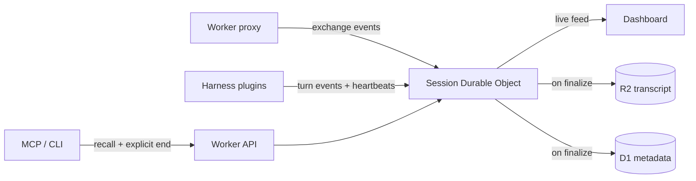

# Session Lifecycle And Harness Capture

**Status: capture path implemented.** The session event format, Session
Durable Object, proxy reporting, events/live/object-state routes, explicit-end
notification, OpenCode plugin, and Hermes plugin are live (see
[`Spec.md`](Spec.md) §7.1). The dashboard live view remains planned.

## The Problem

Transport interception works only when the provider uses a plain API key and
the harness lets its base URL be redirected. Account and subscription
providers (ChatGPT/Codex OAuth, OpenCode subscriptions, the Nous portal) need a
harness-level reporter. The Session Durable Object provides one owner for both
reporting paths while a session is alive.

## The Model

**Two reporters, one owner, one filing cabinet.**

- **Reporters** deliver events. The proxy is one reporter (API-key providers).
  A harness plugin is another (every
  provider, including OAuth and subscription auth, because it observes
  completed turns inside the harness process, above transport and auth
  entirely).
- **The Session Durable Object owns one live session.** It is addressed by
  the session ID (`x-mimir-session` remains the authoritative boundary). It
  collects events, tracks liveness, serves the dashboard's live view, and
  performs the final write. It is a buffer and coordinator, never the source
  of truth.
- **R2 and D1 remain canonical.** Transcripts in R2, searchable metadata in
  D1. The storage model does not change.

One plugin per harness covers every provider that harness can use. The
harness × provider × auth matrix collapses into one reporter per harness.

## How A Session Ends

A session is finalized when **any** of three triggers fires:

1. **End event.** The harness shuts down cleanly and the plugin reports
   `session.end`. Finalization is immediate.
2. **Silence timer.** The plugin heartbeats every 60 seconds while alive. The
   session object arms an alarm on every event; if no event or heartbeat
   arrives for ~10 minutes, the object finalizes the session itself.
3. **Explicit request.** Always available, from two places:
   - **MCP** — `session_end` (already exists). Telling the agent "wrap up and
     end the session" finalizes on the spot.
   - **CLI** — `mimir session end <id>` (exists today as an API client;
     retargeted at the session object). For the human, from any terminal.

All three converge on the same operation: write the transcript to R2, update
the D1 row, let the object sleep.

### Terminal closes

The terminal emulator is irrelevant — it can kill the reporter, never the
session object, which lives on Cloudflare.

| What happens | Trigger | Session written |
| --- | --- | --- |
| Clean quit (exit command, handled SIGHUP) | End event | Immediately |
| Window closed, `kill -9`, crash, network drop | Silence timer | Within ~10 minutes |
| Laptop sleeps mid-session | Silence timer | Finalizes while asleep; continues on wake (see below) |

### Liveness is a projection, not a state

"Is it alive?" and "is it written?" are different questions. The dashboard
answers the first at read time from heartbeat age, which the session object
already tracks — no D1 writes on heartbeat, no lifecycle change:

- Heartbeat within ~90 seconds → **active**.
- Silence past ~90 seconds, not yet finalized → **disconnected · last seen N
  min ago**. Returning heartbeats flip it back to active on the next read.
- Silence timer fires → finalized and written.

The 10-minute timer is a durability backstop, never a UX promise.

### Reopening a session

The session object is named by the harness's own session ID. Reopening a
conversation in the same harness reuses that ID, so the reporter's next event
wakes the same object and the session continues with its full history.

"Finalized" is a state, not a tombstone. New events on a finalized session
flip it back to active; the next finalize rewrites the transcript including
everything. A genuinely new conversation gets a new session ID and a new
object — no deduplication logic.

## Surface After This Lands

| Piece | Role | Change |
| --- | --- | --- |
| Worker proxy | Capture for API-key providers | Reports to session object instead of writing R2/D1 directly |
| Session Durable Object | Owns live sessions: events, liveness, live feed, final write | **New — the only new component** |
| OpenCode and Hermes plugins | Capture for non-proxied providers (OAuth, subscriptions) | Reporter to the same destination |
| MCP (`mimir serve`) | Recall, status, explicit end | Unchanged role |
| CLI | Deploy, login, doctor, serve, session control | No capture path; session control only |
| Dashboard | Sessions from D1 as today, plus live view subscribed to the object | Gains live view, nothing replaced |
| R2 + D1 | Canonical storage | Unchanged |

The CLI deliberately has no capture path: it is never inside the harness's
conversation loop, and wrapping launches would duplicate the plugin worse
from outside.

## Implementation Status

1. **Session event format** — small: session ID, harness, turn payload,
   timestamp, event kind (`turn`, `heartbeat`, `end`).
2. **Session Durable Object** — append events, heartbeat/alarm liveness,
   finalize to R2/D1, websocket feed for the dashboard.
3. **Rewire the proxy** to report to the session object. Existing capture
   behavior must not regress; this is a plumbing change, not a rewrite.
4. **OpenCode plugin** uses OpenCode's official plugin events and resolves the
   Worker URL and token from the Mimir connection files.
5. **Hermes plugin** uses Hermes' plugin hooks. It reports full turns for
   direct providers and liveness-only when the managed proxy route already
   captures turns.
6. **Dashboard live view** consuming the object's feed remains incomplete.

Steps 1–5 are implemented. The reporter plugins are embedded in the Mimir
binary and managed as exact receipt-owned files; manual copying is recovery
only.
