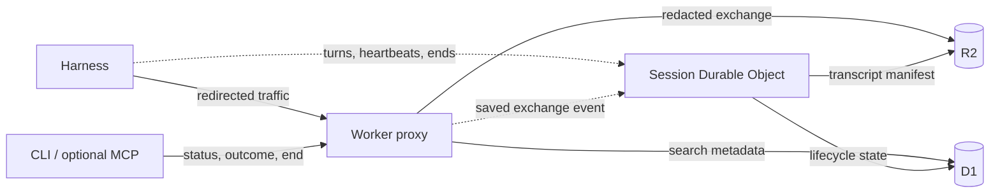

# Session Lifecycle And Harness Capture

Mimir combines two capture paths around one lifecycle owner. The Worker proxy
persists full redacted OpenRouter exchanges. Harness plugins report completed
turn summaries and lifecycle events across harness providers; Hermes suppresses
turns known to have traversed the proxy. One Session Durable Object coordinates
each exact session ID.


```mermaid
flowchart LR
    H[Harness] -->|redirected traffic| W[Worker proxy]
    W -->|redacted exchange| R[(R2)]
    W -->|search metadata| D[(D1)]
    H -.->|turns, heartbeats, ends| S[Session Durable Object]
    W -.->|saved exchange event| S
    S -->|transcript manifest| R
    S -->|lifecycle state| D
    C[CLI / optional MCP] -->|status, outcome, end| W
```

`x-mimir-session` is the authoritative boundary. R2 and D1 are canonical for
saved proxy exchanges, searchable metadata, and finalized lifecycle state. The
Durable Object owns the bounded live plugin-turn buffer; plugin excerpts are
not promoted into the R2 transcript manifest or D1 search metadata.

## Starting

Sessions start lazily. There is no separate start command.

A session starts from the first activity carrying its session ID:

1. A harness start hook sends a heartbeat.
2. The first completed turn arrives if the start hook was missed.
3. The first capture-eligible proxied request carrying `x-mimir-session` is
   successfully saved and reported to the session object.

Installing Mimir, launching an idle harness, or starting `mimir serve` does not
create a session.

## Finalizing

A session finalizes through any of three triggers:

1. **End event.** A supported session-finalize hook reports an end and
   finalization begins immediately. OpenCode sends this for `session.deleted`;
   ordinary process exit relies on the silence timer.
2. **Silence timer.** Every accepted non-duplicate event re-arms a server-side
   alarm. About ten minutes without an event finalizes sessions left by a
   crash, killed terminal, laptop sleep, or network loss.
3. **Explicit request.** MCP `session_end` or CLI
   `mimir session end <id>` finalizes the active generation.

All three write or rewrite `sessions/<id>/transcript.json` in R2, update the D1
lifecycle row, broadcast the final state, and let the Durable Object sleep.
Finalization failures schedule a retry.

Repeated end requests are safe. Retried turns are deduplicated by exchange ID,
and stale heartbeat retries cannot reopen a session that has already
finalized.

## Reopening

Finalization is not a tombstone. New activity carrying the same exact session
ID wakes the same object, preserves its history, and starts another active
generation. The next finalization rewrites the transcript manifest with every
saved proxy exchange still indexed for that session and aggregate plugin-turn
counters. Plugin turn payloads remain only in the bounded Durable Object live
buffer. A genuinely new harness session receives a new ID and therefore a new
object.

This is intentional: a user can resume the same harness conversation after a
clean end, a silence timeout, sleep, or disconnection.

## Liveness

Liveness is a projection from event age, independent of durable capture state
and work outcome:

- **`active`** — an event arrived within about 90 seconds.
- **`disconnected`** — the session has been silent for more than about 90
  seconds, but its finalization alarm has not fired.
- **`finalized`** — the final transcript and lifecycle write completed.

Returning activity can move `disconnected` or `finalized` back to `active`.
The ten-minute timer is a durability backstop, not a liveness promise.

## Capture Responsibilities

| Component | Responsibility |
| --- | --- |
| Worker proxy | Stream upstream responses; redact and persist full exchanges to R2/D1; report saved exchanges to the session object |
| OpenCode plugin | Report completed turns, heartbeats, and supported lifecycle events across OpenCode providers |
| Hermes plugin | Report direct-provider turns and lifecycle events; suppress duplicate turns for known proxied traffic |
| Session Durable Object | Coordinate liveness, retries, reopening, live feed, transcript manifests, and D1 lifecycle state |
| CLI | Primary search, inspection, outcome, explicit-end, deployment, and diagnostics surface |
| MCP | Optional adapter over the same memory operations |
| Dashboard | Access-protected session and request views backed by Worker APIs |

Plugin events contain summaries and excerpts, not full transport archives.
Only traffic that reaches the Worker proxy produces full redacted exchange
objects.

## Persistence Verification

Transport success is not proof that an exchange was saved. Use:

```bash
mimir session status <id>
```

or MCP `session_status`. The authoritative receipt distinguishes saved,
pending, partial, failed, and uncaptured sessions. Capture state and work
outcome remain independent.
